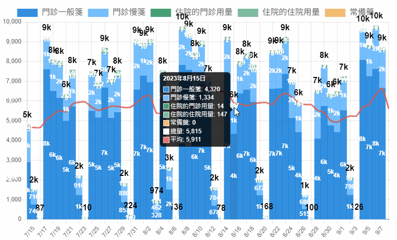

+++
title = '藥品消耗資料視覺化'
slug = '2023-09-medicine-consumption-data-visualization'
date = 2023-09-12T16:13:53+08:00
draft = false
isCJKLanguage = true
showToc = true
TocOpen = true
categories = ['Data Visualization']
tags = ['Python','MySQL','Database','Chartjs','PyAutoGUI','PHP','MariaDB','Data Visualization','資料視覺化','視覺化','自動操作','Pandas','DataFrame','資料庫','圖表']
[cover]
image = 'Data-Visualization.png'
+++
身為藥庫管理藥師，最重要的事情就是確保藥品的供應無虞，因此對於藥品的消耗情形必須有一定的敏感性，當發生異常波動才能有辦法立刻做出應對決策。

隨著大數據的時代來臨，在 2016 年就有人提出資料視覺化 (Data Visualization) 的概念，以好懂的圖表呈現數字，可以用直覺的方式快速掌握資料特性。

受惠於資料視覺化的概念，雖然單間醫院的藥品消耗數量沒有達到大數據級的規格，但是資料視覺化的應用可以增加藥師對於藥品的數據敏感性，讓藥師不再受限經驗，除了可以提升人力訓練速度，也避免讓藥師跌入經驗偏差。
***
## 資料收集
### pyautogui
醫院藥師不是資訊室人員，對於醫師在何時幫哪個病人開了哪個藥的資料，因為涉及到病人安全與個資法規範，只能從資訊室提供的程式實時查詢匯出檔案，再利用 Excel 等程式將資料另做分析。

即時的需求，當然可以直接操作系統。但如果要**自動化**製作每天的圖表，勢必得使用自動操作的方式，並且在**非上班**的時段把檔案匯出（向資訊室查詢大筆資料其實滿耗時）。

為了不驚擾資訊室工程師，可以利用 Python 自動操控滑鼠鍵盤的 Package [`PyAutoGUI`](https://pypi.org/project/PyAutoGUI/) ：
```bash
pip install pyautogui 
```

程式的部分，使用以下幾個語法互相搭配，模擬手動操作院內程式：
```python
#先引用套件或模組進來
import os
import time
import pyautogui

os.system('TASKKILL /F /IM <院內程式名稱>.exe 1>NUL 2>NUL') #強迫關閉當掉的院內程式
time.sleep(10) #暫停執行10秒鐘
os.popen('<院內程式名稱>.exe') #執行院內程式，這邊要使用絕對路徑比較保險
time.sleep(1.5) #執行院內程式時，緩衝執行1.5秒鐘

pyautogui.click((x,y)) #滑鼠點擊螢幕的 x 座標和 y 座標
pyautogui.click((x,y), clicks=2) #滑鼠點兩次

pyautogui.write('文字', interval=0.01) #以 0.01 秒的間隔輸入文字，不能是中文

pyautogui.press('enter') #按下 Enter 鍵
pyautogui.press('shift') #按下 Shift 鍵，通常用來切換中英輸入法
pyautogui.hotkey('alt', 'f4') #同時按下 Alt 和 F4 鍵來關閉現在的視窗
```
>檔名或是指定目錄的部分，我習慣使用**絕對位置**告訴 python 檔案位置，避免受到執行 python 檔案時的目錄位置影響。
>
>而且因為 windows 的路徑是採用 `\` 反斜線，在 python 中反斜線會用來表示轉義字串，例如 `\n` 就是換行。
>
>為了避免路徑受到轉義的影響，要使用兩個反斜線 `\\` ，例如 `'C:\Users\Desktop\'` 就會寫成 `'C:\\Users\\Desktop\\'` 比較沒有問題。


定位每個操作的滑鼠座標是撰寫這個程式的大工程，可以用以下的 python 程式來記錄：
```python
import pyautogui
while True:
    if pyautogui.position() == (0, 0):
        quit()
    prev_position = pyautogui.position()
    if pyautogui.position() != prev_position:
        print(pyautogui.position())
```
或者網路上有其他現成的小工具也可以輔助，例如 [AutoHotkey](https://www.autohotkey.com/) 等等。

院內程式匯出的檔案格式有限，過去藥師們會使用 xls 檔案以利於後續的編輯操作。現在需要的報表為了繪圖，通常都會超過 65536 列 (rows；橫的；中國稱行)，所以只能存成文字檔，例如 csv ，避免資料流失或是院內程式存不起來。

### 批次執行檔 Batch
因為涉及到模擬滑鼠跟鍵盤的操作，執行的時候必須取得系統管理者權限，以此越過 User Access Control (UAC) prompt。

但是執行程式時，並沒有人再電腦前面手動變更權限，因此後來寫了一個 Batch 檔，取得權限後再執行 python ，以下是網路找到取得權限的寫法。
```batch
@echo off
>nul 2>&1 "%SYSTEMROOT%\system32\cacls.exe" "%SYSTEMROOT%\system32\config\system"
if '%errorlevel%' NEQ '0' ( goto UACPrompt ) else ( goto gotAdmin )
:UACPrompt
    echo Set UAC = CreateObject^("Shell.Application"^) > "%temp%\getadmin.vbs"
    echo UAC.ShellExecute "%~s0", "", "", "runas", 1 >> "%temp%\getadmin.vbs"
    "%temp%\getadmin.vbs"
    exit /B
:gotAdmin
    if exist "%temp%\getadmin.vbs" ( del "%temp%\getadmin.vbs" )
    pushd "%CD%"
    CD /D "%~dp0"

python pyautogui檔案的絕對路徑.py
```
把這個檔案存成 .bat 檔，執行該程式時就可以用系統管理者權限來操作鍵盤滑鼠。

### 工作排程器
python 好像也可以處理定時執行程式的寫法，但是因為不太習慣背景開一個自己寫的程式在執行，後來選擇的是 Windows 內建的工作排程器。

可以在 `開始 > Windows系統管理工具 > 工作排程器` 的資料夾裡面找到他，或是按下 `Win+R` 輸入 `taskschd.msc` ，~~不知道為什麼經過一陣卡卡的~~，就會看到下面這個畫面：

點選右側選單的 `建立基本工作` 或 `建立工作` ，依序輸入希望執行時間和間隔時間：

啟動程式填入剛剛形成的 Batch 檔案，便可以在指定的時間重複執行自動鍵盤滑鼠了。
***
## 資料結構化
以本院為例，依照門診藥局與住院藥局等單位區分，總共會經過四次查詢，匯出四個檔案：

因為院內系統是不同的工程師負責，匯出的報表各自的 header 和時間日期格式都不一樣。所以需要將這四張表統一 header ，並且結合在一起。如果因此出現空值，還必須填入一個特定的字樣。
>例如門診藥局會有慢箋資料，但是住院藥局並不適用，因此報表就不會有。

這樣子的工作，交給 Python 知名的資料表分析 Package [`Pandas`](https://pypi.org/project/pandas/) 最適合不過。
```bash
pip install pandas 
```
這裡會用到 pandas 的 DataFrame 的功能， DataFrame 就是一張表格，具有欄 (columns；直的；台灣有時稱行；中國稱列) 跟列 (rows；橫的；中國稱行；pandas有時會稱為index)。可以利用以下的語法，將已經匯出完成的 csv 讀成 DataFrame。
```python
import pandas as pd #習慣上縮寫成pd
df = pd.read_csv(檔名, encoding='utf-16le', dtype=str)
#把單一個csv抓近來，習慣上縮寫成df，院內匯出報表會有語系問題，而且也不要讓系統自動判斷字串型別

df = df[['病歷號','日期','藥品代碼','總量','慢箋次數']]
#用這個方式選擇指定的欄，不用全部的欄都拉進來

df.loc[df['慢箋次數'].isna(), '慢箋次數'] = '不適用'
#如果欄位'慢箋次數'在某筆資料中是空值，則在'慢箋次數'自己的欄位中填上'不適用'

df = df.rename(columns={'病歷號':'pt','日期':'date','藥品代碼':'drug','總量':'total','慢箋次數':'refill'})
#修該欄位名稱使各csv的欄位能夠統一

df = df.fillna('無資料')
#將預設值填入空格。如果不填東西，pandas會自動判斷為float中的NaN，處理起來會相對麻煩。

df = pd.concat([opd,ud,mbd,other], ignore_index=True)
#將修改好的各單位df，使用concat功能結合在一起
```
### pd.concat
幾個比較常用的參數如底下程式碼，剩下的可以參考[官方文件](https://pandas.pydata.org/docs/reference/api/pandas.concat.html)：
```python
df = pd.concat(
    [list of DataFrames],
    axis = 0,
    ignore_index = False,    
    join = 'outer'
)
```
1. **axis = 0** 指的是直向合併，如果要橫向合併則為 1 。
2. **ignore_index = False** 表示合併之後的 index 需要保留原本各自的樣子，如果設定為 True ，則從首列依序標上 1、2、3...。
3. **join = 'outer'** 看下列的圖片說明。


我習慣上會將兩個表格的 columns headers 整理成一樣的才會 concat ， join 的機會其實不多。
真的需要 join 的時候，我會使用 pandas 的 merge 方法，比 concat 還更好用。
***
## 資料庫與資料分割
有一個麻煩的情形是，已經發生的病人藥品消耗量**並不是定值**，醫師可以隨時修改自己前段時間的處方等情形，因此前段時間的消耗量會隨著各種原因產生變化。

所以資料匯出，無法單獨抓昨天一天的報表，必須往前抓至少一個月的資料並且覆蓋昨天匯出的報表。總資料也必須保留至少一年份的時間區間，才有利於視覺化後出現可觀察的趨勢和波動。這樣子的資料讀寫與儲存量，以 2023 年 9 月為例，平均每日會有 61 萬筆資料複寫，一年份的總資料至少 685 萬筆。

面對如此龐大的資料，當時的我使用了免費的關聯式資料庫 MySQL ( 現在使用 MariaDB ) 來管理資料。並且以藥品名稱的第一個英文字母來進行資料分割，共分割成 27 張 data tables (其他非英文開頭的藥品，規劃為consmp_0)。
```MySQL
CREATE TABLE `consmp_字首` (
  `id` int(10) NOT NULL,
  `pt` varchar(7) NOT NULL,
  `date` varchar(8) NOT NULL,
  `drug` varchar(6) NOT NULL,
  `total` varchar(20) NOT NULL,
  `refill` varchar(10) NOT NULL
) ENGINE=InnoDB DEFAULT CHARSET=utf8;

ALTER TABLE `consmp_字首`
  ADD PRIMARY KEY (`id`),
  ADD KEY `drug` (`drug`),
  ADD KEY `drug_date` (`drug`,`date`);

ALTER TABLE `consmp_字首`
  MODIFY `id` int(10) NOT NULL AUTO_INCREMENT;
COMMIT;
```

剛剛合併的 DataFrame 可以用下面的方式分割後存入 MySQL 資料表中：
```python
import datetime #日期時間
import mysql.connector
from sqlalchemy import create_engine
engine = create_engine('mysql+mysqlconnector://使用者名稱:密碼@伺服器存在位置IP:埠號/資料庫名稱')

for cap in [chr(i) for i in range(65, 91)]:
    df_cap = df.loc[df['drug'].str.startswith(cap)]
    #consmp_0需另外處理

    from_date = (today - datetime.timedelta(days=30)).strftime('%Y%m%d')
    engine.connect().execute(f"DELETE FROM `consmp_{cap}` WHERE `date` >= '{fromdate}'")
    #清除要被覆蓋的資料

    df_cap.to_sql(name=f'consmp_{cap}', con=engine, if_exists='append', index=False)
    #直接利用 pandas 的 to_sql 方法 append 到資料庫中
```
***
## 視覺化效果
在 MariaDB 中建立龐大的資料庫之後，接著就是選擇一種工具將資料庫的數據查詢後計算總和，並且以圖表呈現。一般企業首選大概是 Microsoft 的 Power BI ，可以對各種資料進行區塊排版，形成互動式的 dashboard 。其他選擇像是 Tableau 等都是主打不用寫任何語法就可以直接產生視覺化報表的應用程式。

我自己習慣以網頁呈現，好處是：
1. 使用的程式碼本身開源免費，使用 CDN 減少本地端的檔案。
2. 畫面用瀏覽器即可打開，不需額外安裝軟體。

缺點是部分程式碼需要自己刻，因為我都是單人開發，當時這件視覺化計畫也有點像是 side project ，沒有時間上的壓力，如果需要更多的客製化或是增加使用者體驗的調整上可能也比較自由一點。
### PHP
於是我使用自己熟悉的 PHP ，串接資料庫計算後，丟給 chartjs 形成圖表。

為了產生圖表，需要產生的資料形式，大概會是**連續不中斷**的日期對上總和的一個陣列 (array) 資料，如下：
```php
<?php
array(
    "日期" => 數量,
    "日期" => 數量,
    "日期" => 數量,
    "日期" => 數量,
    "日期" => 數量,
)
```
如果要產生上面的陣列，可以在 php 中連接資料庫後直接用 MySQL GROUP BY 查詢返回 SUM 來計算總和：
```php
<?php
$conn = new PDO("mysql:host=伺服器存在位置IP;dbname=資料庫名稱;charset=utf8;port=埠號", "帳號名稱", "密碼");
$conn->exec("SET NAMES utf8");

$cap = is_numeric(substr($drug, 0, 1)) ? 0 : substr($drug, 0, 1);
//本院藥品代碼有一部是數字開頭，不屬於26個英文字母，規劃上讓這些代碼歸入consmp_0資料表中。

$sql = "SELECT `date`, SUM(`total`) AS qty FROM consmp_$cap WHERE `drug` = '$drug' GROUP BY `date`";
$rows = $conn->query($sql)->fetchAll(PDO::FETCH_ASSOC);
//以上會產生出 $rows = array("日期" => 數量,); 的陣列。
```
但是無法保證直接查詢結果的日期是連續日期。例如禮拜天如果沒有消耗資料，就完全不會有該天的資料，並不會顯示 `禮拜天 => 0` ，而是直接從禮拜六就跳到禮拜一，為了避免這樣的狀況，要重新建立一個具有**連續日期**的陣列，再把舊陣列資料儲存進去。
```php
<?php
$period = new DatePeriod(new DateTime("起始日期"), new DateInterval("P1D"), new DateTime("+2 days"));
foreach ($period as $date) {
    $data[$date->format("Ymd")] = 0;
}
foreach ($rows as $row) {
    $data[$row["date"]] = $row["qty"];
}
//以上會產生出 $data = array("日期" => 數量,); 的陣列。
```
### Chartjs
 
我自己學 css 和 javascript 學的非常非常爛，日新月異的技術完全跟不上，目前網頁的 css 甚至是使用 [Bootstrap](https://getbootstrap.com/) 的懶人框架，而圖表的 javascript 程式庫，大概找了以下幾個：
- Google Chart Wizard (現已改成 Google Chart API)
- D3
- HighCharts
- Plotly
- Chartjs

後來選擇了 [Chartjs](https://www.chartjs.org/) ，因為 Sample 看得比較順眼。

根據官網指引，先在引入所有需要的函式庫，也包含增加圖表操作的使用者體驗需要引入的 plug-in 函式庫。~~至於效能還是安全性，就先放過我吧。~~
```html
<script src="https://code.jquery.com/jquery-3.6.1.min.js"></script>
<script src="https://cdn.jsdelivr.net/npm/chart.js"></script>
<!--chartjs plugin-->
<script src="https://cdn.jsdelivr.net/npm/chartjs-plugin-datalabels@2"></script>
<script src="https://cdnjs.cloudflare.com/ajax/libs/hammer.js/2.0.8/hammer.min.js"></script>
<script src="https://cdnjs.cloudflare.com/ajax/libs/chartjs-plugin-zoom/1.2.0/chartjs-plugin-zoom.min.js"></script>
<script src="https://cdnjs.cloudflare.com/ajax/libs/luxon/2.2.0/luxon.min.js"></script>
<script src="https://cdn.jsdelivr.net/npm/chartjs-adapter-luxon@^1"></script>
```
在需要放圖表的地方加入 `<canvas>` ：
```html
<div class="chart-container rounded mx-auto" style="height:79vh; width: 65vw;">
    <canvas id="consmp_chart"></canvas>
</div>
```
在 `</body>` 之前的位置加入 `<script>` ，因為整個程式碼太長，利用變數對應方便往後的程式碼閱讀，但是要記得把變數寫在 `new Chart()` 之前：
```html
<script>
//顯示圖表
new Chart($('#consmp_chart'), {
    data: {
        datasets:[
            opdcm, //門診一般處方資料
            opdrf, //門診連續處方資料
            udopd, //住院藥局值班時段 (住院的門診) 處方資料
            udud, //住院藥局一般時段 (住院的住院) 處方資料
            std, //各單位以常備藥向藥局請領資料
            all, //資料總和->不顯示顏色，只顯示 datalabel
            ma //移動平均線
            ]
        },
    options: option //功能控制
});
</script>
```
各個處方資料 datasets 的變數，是利用 php 迴圈直接 echo 在 javascript 上面。但其實比較好的做法應該是用 php 寫一支 API ，再用 javascript 去串 API append 回程式中。~~以後如果有重構再說。~~ 

以 opdcm 門診一般處方資料為例：
```html
<script>
//門診一般處方資料
const opdcm = {
    label: '門診一般箋',
    type: 'bar',
    data: [ //用 php 迴圈 echo 直接印出日期和數量
        <?php foreach($d["opdcm"] as $dt=>$q) { echo "{x:'$dt',y:$q},"; } ?>
        ],
    backgroundColor: 'rgba(2,117,216,0.8)',
    barPercentage: 1,
    categoryPercentage: 1,
    datalabels: {   //plug-in: datalabel 的文字顏色
        color: 'rgb(255,255,255,1)'
        } 
}
</script>
```
總量和移動平均線的設計則是折線圖 `type: 'line'` 。如果使用直條圖，會跟原本的用量直條圖疊 (stack) 在一起，讓整個圖表不美觀。同時也要調整 datalabel 的顯示方式，如果整體是正值顯示在線條上方，整體是負值就顯示在線條下方：
```html
<script>
//總量
const dall = {
    label: '總量',
    data: [
        <?php foreach($d["all"] as $dt=>$q) { echo "{x:'$dt',y:$q},"; } ?>
        ],
    type: 'line',
    pointBorderColor: 'rgba(255, 255, 255, 0)', //不需要線條顏色
    pointBackgroundColor: 'rgba(255, 255, 255, 0)',
    pointBorderWidth: 0, //不需要資料點
    pointRadius: 0,
    pointHoverBorderWidth: 0,
    pointHoverRadius: 0,
    showLine: false, //不需要顯示線
    datalabels: {
        color: 'rgb(0,0,0,1)',  //字體顏色
        font: {size: 16},
        align: function(context) {  //如果是正值，顯示在線上
            var value = context.dataset.data[context.dataIndex].y;
            return value > 0 ? 'end' : 'start';
        },
        anchor: function(context) { //如果是負值，顯示在線下
            var value = context.dataset.data[context.dataIndex].y;
            return value > 0 ? 'end' : 'start';
        }
    }
}
</script>
```
>**藥品消耗量是負值是什麼意思？**
>
>多半發生在住院藥局，例如可能前幾天醫師開了一些抗生素準備讓病人使用，卻因為一些原因，例如病人情形突然惡化不適合施打、病人血液細菌培養出來不適合該種抗生素治療，等原因讓醫師刪掉先前的處方，此時住院藥局會收到退藥，所以消耗量為負值。

另外 option 的部分因為要引入眾多 plug-in 所以程式滿長的，以下會把每個物件單獨拆散出來說明：

不要維持預設的圖表長寬比例。
```html
<script>
const option = {
    maintainAspectRatio: false,
}
</script>
```
X 軸為時間，並以 luxon 計算刻度； Y 軸的資料要堆疊， chartjs 的堆疊行為只發生在 bar ，因此如果資料列使用 line 不會受到影響。
```html
<script>
const option = {
    scales: {
        x: {
            type: 'time',
            stacked: true,
            time: {
                unit: 'day',
                displayFormats: { day: 'M/d' },                        
                tooltipFormat: 'y年M月d日'
            },                        
            max: luxon.DateTime.now().minus({day: 1}).toJSDate(),            
            min: luxon.DateTime.now().minus({month: 2}).toJSDate(),
        },
        y:{
            stacked: true,
        }
    },
}
</script>
```
圖表上方的圖例， chartjs 是預設全部顯示，但是我們不需要總量和移動平均值的圖例。
```html
<script>
const option = {
    plugins:{
            legend: { 
                display: true,
                labels: {
                    font: {
                        size: 16,
                        family: "'Roboto','Noto Sans TC'"
                    },
                    filter: function(item,data) {
                        if (!(item.text=='平均') && !(item.text=='總量')) { return true; }
                    }
                }
            },
    }
}
</script>
```
滑鼠指到資料點上的時候會產生的圖示說明，項目需要依照指定的順序堆疊。因為移動平均線顯示在整個直條圖的最上層，所以預設的圖示說明順序也是平均最上面，但我們希望平均能夠在最下面。
<!---->

```html
<script>
const option = {
    plugins:{
        tooltip:{
            enabled: true,
            itemSort: function (a, b) { return a.datasetIndex - b.datasetIndex; }
        },
    }
}
</script>
```
希望圖表能夠用滑鼠滾輪放大及縮小 X 軸的時間刻度，並且點住不放可以水平拖動到自己想要的刻度處。如此可以稍微增加一點圖表的互動性和使用者自由度的觀感。
```html
<script>
const option = {
    plugins:{
        zoom:{
            zoom:{
                wheel: { enabled: true, },
                mode: 'x'
            },                       
            pan:{
                enabled: true,
                mode: 'x',
            },
            limits: { x: { max: 'original' } }
        },
    }
}
</script>
```
如果數字太大，可以省略顯示千為 k ，萬為 w 。
```html
<script>
const option = {
    plugins:{
        datalabels: {
            formatter: function (value, context) {
                return value.y>9999 ? Math.round(value.y/10000) + 'w' : 
                value.y>999 ? Math.round(value.y/1000) + 'k' : 
                value.y!=0 ? value.y : '' ;
            },
            font: { weight: 'bolder' },
        }
    }
}
</script>
```
剩下的可能要自己參考官方說明。另外 chartjs 有在持續更新中，所以如果有看到 stackoverflow 上面有問題的解答，可能要看一下版本是否相容。
***
## 成果
