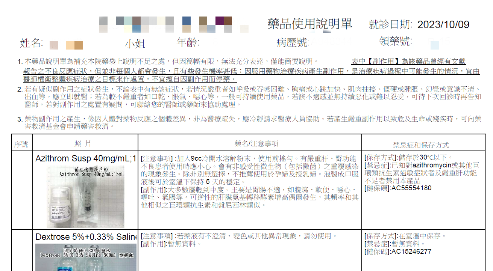

+++
title = '藥品衛教單張自動更新'
slug = '2023-11-medication-guidance-leaflet-auto-update'
date = 2023-11-15T12:15:58+08:00
draft = false
isCJKLanguage = true
showToc = true
TocOpen = true
categories = ['Python','PHP']
tags = ['Python','PHP','PDF','FTP','醫院','藥品','衛教單張','說明書','QR code','ReportLab','pdfgen','platypus','threading','Multithreading','Multiprocessing','ftplib']
+++

醫院領到的藥品通常都是一個藥袋裝著一種藥品，按照[藥師法第 19 條規定](https://law.moj.gov.tw/LawClass/LawSingle.aspx?pcode=L0030066&flno=19)，藥袋上必須印有姓名、性別、藥品名稱、劑量、數量、用法、作用或適應症、警語或副作用、藥局名稱及藥師姓名、調劑日期的標示。


然而藥品的說明與注意事項詳細謄寫起來通常是一個藥袋的大小放不完的，所以每家醫療機構都會製作「藥品衛教單張」，額外對藥袋內容不足的地方加以補充說明。

***
## 衛教單張改良計畫
本院資訊室目前提供的衛教單張，是當民眾前來向藥師索取時，藥師以院內系統列印該病人當天所有藥品的資訊，並且把所有資訊表列在 A4 大小的紙張上，每個字比螞蟻還小，而且字體是新細明體令人難以閱讀。


　

比較理想的衛教單張，應該是**一種藥品一張 A4** ，避免文字過小，也不會與其他藥品混淆。並且應該使用**電子方式**供民眾閱覽，例如以 QR code 提供民眾掃描後直接以手機觀看，減少紙張印刷。

關於電子檔的提供格式，使用手機開啟時可能會開啟不順利，甚至受限於瀏覽器影響排版的 doc 檔、 odt 檔，圖片類型的 png 檔或 jpg 檔，也會因為放大觀看，因為解析度問題造成模糊，都不是上選。首選的電子衛教單張檔案格式應該是 **pdf 檔案**，是目前手機瀏覽器泛用可接受的檔案格式。

因為資安問題，本院資訊室無法讓我直接修改醫院官方網站的部分頁面，折衷方式是允許我使用 FTP 將預先製作好的檔案上傳，並且讓民眾連結到該檔案下載或直接閱讀。

因此可以利用 Pandas 讀入藥品品項檔，依藥品代碼方別抓出藥品名稱、藥品作用、注意事項、副作用、保存方法等等，用以製作 pdf 檔。
***
## Python 製作 pdf
### ReportLab
使用 [ReportLab](https://www.reportlab.com/) 的函式庫來進行 pdf 檔的製作，說明文件在[這裡](https://docs.reportlab.com/reportlab/userguide/ch1_intro/)。

首先是安裝函式庫：
```powershell
pip install reportlab
```

ReportLab 的函式庫製作 pdf 有三種方法：
- pdfgen ：直接新增一張空白的圖層，在上面利用各種方法和座標新增文字或圖片。
- platypus ：新增一張已經設定好框架的物件，利用方法將文字或圖片依序填入框架。
- RML ：撰寫 ReportLab 自創的語法，並直接將語法轉成 pdf 。

因為我們要產生的檔案形式屬於簡單的文字和圖片，直接使用 pdfgen 就可以達成需求了，如果是比較長的文字中間嵌入 platypus 即可。

官方的說明還是有點小複雜，直接看實作來理解程式碼，先引入函式庫：
```python
from reportlab.pdfgen import canvas
from reportlab.lib.pagesizes import A4
# 建立圖層 (紙張)

from reportlab.lib.utils import ImageReader
# 引入圖片

from reportlab.pdfbase import pdfmetrics
from reportlab.pdfbase.ttfonts import TTFont
pdfmetrics.registerFont(TTFont('kai', '路徑\\edukai-4.0.ttf'))
# 引入字體

from reportlab.platypus import Paragraph
from reportlab.lib.styles import ParagraphStyle
# 處理大段落文字
```
這邊的字體需要能支援中文、增加使用者閱讀體驗、商用版權也必須納入考量，可以使用 google 的 Noto Sans ，範例裡使用的是台灣教育部的楷體，相關授權說明在[這邊](https://language.moe.gov.tw/001/Upload/Files/site_content/M0001/edukai.pdf)。


　

建立檔案：
```python
pdf = canvas.Canvas('路徑\\檔名.pdf', pagesize=A4)
```
這張新的 A4 紙在 reportlab 中的座標系統是以紙張左下角為原點，並以英吋作為刻度：


　

新增 pdf 檔案資訊：
```python
pdf.setAuthor('某某醫院藥劑科')
pdf.setTitle('某某醫院藥品資訊說明單張')
pdf.setSubject('某某醫院藥品資訊說明單張')
```

　

浮水印製作：
```python
pdf.saveState()
#因為等一下會旋轉坐標系，先儲存原始狀態

pdf.rotate(57.47) 
# 順時針旋轉坐標系 57.47° 角

pdf.setFillColorRGB(245/255, 245/255, 245/255)
# 設定字體填充顏色，此處 RGB 的數值為百分比

pdf.setFont('kai', 128)
# 設定字體類型與大小

pdf.drawString(60, -45, '某某醫院藥劑科')
# 在座標 (60, -45) 寫上 '某某醫院藥劑科'

pdf.restoreState()
# 回覆設定，包含旋轉、設定顏色、設定字體至剛剛儲存的狀態
```
預覽結果：


　

貼上圖片：
```python
logo = ImageReader('路徑\\hospital.png')
# 讀入圖片

iw, ih = logo.getSize()
aspect = ih / float(iw)
# 抓取原本圖表的寬跟高，並且計算圖片比例，避免調整失真

pdf.drawImage(logo, x=50, y=720, width=80, height=80*aspect, mask='auto')
# 將圖片貼在座標 (50, 720)，並調整寬度為 80 英吋，高度隨比例調整 
# 這邊的座標 (50, 720) 是圖片左下角的對齊點
```
預覽結果：


　

加入標題：
```python
pdf.setFont('kai', 32)
pdf.drawString(x=160, y=750, text='某某醫院藥品資訊說明單張')
```
預覽結果：


　

加入形狀和線條的設計：
```python
pdf.setFillColorRGB(230/255, 240/255, 254/255, 0.5)
# 設定填充顏色

pdf.roundRect(x=50, y=50, width=100, height=650, radius=10, stroke=0, fill=1)
# 在座標 (50, 50) 繪製一個寬 100 英吋，高 650 英吋的矩形，四角弧度 10 ，不需要框線，實心填充

pdf.setStrokeColorRGB(230/255, 240/255, 254/255) 
# 設定線條顏色

pdf.line(x1=150, y1=700, x2=550, y2=700)
pdf.line(x1=150, y1=550, x2=550, y2=550)
pdf.line(x1=150, y1=470, x2=550, y2=470)
pdf.line(x1=150, y1=390, x2=550, y2=390)
pdf.line(x1=150, y1=220, x2=550, y2=220)
pdf.line(x1=150, y1=120, x2=550, y2=120)
# 從座標 (x1, y1) 畫一條線條到座標 (x2, y2)
```
預覽結果：


　

很長的文字的部分，因為 `drawString` 只能設定起始座標點，沒有寬度，所以也無法換行，會直接單行印出並超出紙張。因此必須使用高階一點的方法：
```python
bodytext = ParagraphStyle('隨便命名', fontName='kai', fontSize=16, leading=18)
# 設定 platypus 的文字屬性，leading 為行距

text = Paragraph('已知對azithromycin或其他巨環類抗生素過敏症狀者及嚴重肝功能不足者禁用本產品！加入 9cc 冷開水溶解粉末，使用前搖勻。有嚴重肝、腎功能不良患者使用時應小心。會有非感受性微生物（包括黴菌）之重覆感染的現象發生。除非別無選擇，不推薦使用於孕婦及授乳婦。泡製成口服液後可於室溫下保持 5 天的穩定。', bodytext)

text_w, text_h = text.wrap(availWidth=380, availHeight=1000)
# 設定該文字最大允許寬度和最大允許高度，並利用變數接取計算後的實際寬度和實際高度

text.drawOn(pdf, x=166, y=374-text_h)
# 將長文字貼上原本的紙張，因為坐標系是左下角，可能會因為文字段落的高度不一產生無法對其上緣的問題
# 因此座標 y 軸設定為 374-text_h 減去實際高度
```
預覽結果：

　


所有文字依序貼入後，完成並輸出：
```python
pdf.showPage()
pdf.save()
```
如此便能完成一種藥品的衛教單張，並儲存成指定的檔名。


***
### threading.Thread
接下來就是利用先前提到的遍歷藥品品項檔方法來逐一製作 pdf 檔：
```python
def make_pdf(藥品代碼):
    pdf = canvas.Canvas(f'路徑\\{藥品代碼}.pdf', pagesize=A4)
    ...
    ...
    pdf.showPage()
    pdf.save()

med = pd.read_csv('藥品品項檔.csv')
dflist = []
for _,row in med.iterrows():
    make_pdf(row['藥品代碼'])
```

但是這次涉及大量的檔案輸出，一個作完才換下一個的效率實在太差，所以我們改用多線程 (Multithreading) 的方式進行：

```python
import threading
# 直接引入不須安裝

def make_pdf(藥品代碼):
    pdf = canvas.Canvas(f'路徑\\{藥品代碼}.pdf', pagesize=A4)
    ...
    ...
    pdf.showPage()
    pdf.save()

med = pd.read_csv('藥品品項檔.csv')
med_list = med['藥品代碼'].tolist()

def iter_medlist(start, split):
    # 將藥品品項檔直接用 slice 切塊
    for code in med_list[start::split]:
        make_pdf(code)

thread_list = [threading.Thread(target=iter_medlist, args=(i, 8)) for i in range(8)]
# 將藥品品項檔切成 8 塊，並用 threading.Thread 方法包住
for t in thread_list:
    t.start()
for t in thread_list:
    t.join()
# 執行線程
```
如此就會將藥品品項檔切成八個部分，分別製作 pdf 檔輸出，效率會比較高一點。

> Python 多工處理分成多線程 (Multithreading) 和多進程 (Multiprocessing)，可以參考這兩篇文章：[AsyncIO, Threading, and Multiprocessing in Python](https://ivankao.ichweblog.com/blog/706/)、[python thread multiprocess 比較總整理](https://www.wongwonggoods.com/all-posts/python/python_parellel/python-thread-multiprocess/)。本文中的 pdf 製作也用過多進程，與多線程相比反而慢了一些，因此用多線程足矣。
***

## PHP 製作 pdf
### setasign\Fpdi
最一開始其實是希望醫院官方網站可以讓我直接上傳 php ，民眾連結網址利用 URL 變數直接形成 pdf 檔。資訊室一開始什麼都沒說，在我辛辛苦苦研究出來後，資訊室才說不行，~~有夠讚 ^^~~，所以我直接把程式碼擺上來就不另外說明了。

安裝 [Composer](https://getcomposer.org/) ，我當初是直接使用官方的 exe 檔安裝的， Windows 作業平台直接無痛使用 exe 就好。

接著新增一個資料夾在網頁伺服器的根目錄裡面，例如 `伺服器根目錄\mgl\` ，並且確認可以使用 `http://localhost/mgl/` 連到資料夾中。然後在資料夾裡面建立一個 `composer.json` 檔案，內容是：
```json
{
    "require": {
        "tecnickcom/tcpdf": "6.3.*",
        "setasign/fpdi": "^2.0"
    }
}
```
套件的 github 在[這裡](https://github.com/Setasign/FPDI)，另外使用 tcpdf 是為了產生 UTF-8 的中文字。

使用指令把 php 套件下載下來：
```powershell
composer install
```

建立 php 檔案，例如 `伺服器根目錄\mgl\mgl.php`，引入套件：
```php
<?php
use setasign\Fpdi\Tcpdf\Fpdi;
require_once("vendor/autoload.php");
$pdf = new Fpdi();
``` 

新增頁面， php 套件預設的座標系以左上角為原點， x 軸正值往右， y 軸正值往下：
```php
$pdf->AddPage();
```

新增 pdf 檔案資訊：
```php
$pdf->SetAuthor("某某醫院藥劑科");
$pdf->SetTitle("某某醫院藥品資訊說明單張");
$pdf->SetSubject("某某醫院藥品資訊說明單張");

$pdf->setPrintHeader(false);
$pdf->setPrintFooter(false);
//頁首頁尾會預設有兩條直線，很醜，不用這個功能。
```

浮水印製作：
```php
$pdf->StartTransform();
$pdf->SetFont("kai", "", 72);
$pdf->SetTextColor(240, 240, 240);
$pdf->Rotate(45, 100, 200);
$pdf->Text($w=50, $h=150, "某某醫院藥劑科");
$pdf->StopTransform();
$pdf->SetTextColor(0, 0, 0);
```

貼上圖片：
```php
$logo = "路徑\\hospital.png";
$pdf->Image($logo, $x=35, $y=10, $w=23, $h=20, $type="png", $link="", $align="T", $resize=true, $dpi=300, $palign="");
```

加入標題：
```php
$pdf->SetFont("kai", "", 24);
$pdf->MultiCell($w=180, $h=0, "某某醫院藥品資訊說明單張", $border=0, $align="L", $fill=false, $ln=1, $x=67, $y=10, $reseth=true, $stretch=0, $ishtml=false, $autopadding=true, $maxh=0, $valign="T", $fitcell=false);
```

加入形狀和線條的設計：
```php
$pdf->SetFillColor($R=241, $G=237, $B=248);
$pdf->RoundedRect($x=10, $y=35, $w=30, $h=240, $r=3.50, "1111", "F");
$pdf->SetDrawColor($R=198, $G=182, $B=227);
$pdf->Line($x1=40, $y1=35, $x2=200, $x2=35);
$pdf->Line($x1=40, $y1=90, $x2=200, $x2=90);
$pdf->Line($x1=40, $y1=120, $x2=200, $x2=120);
$pdf->Line($x1=40, $y1=150, $x2=200, $x2=150);
$pdf->Line($x1=40, $y1=190, $x2=200, $x2=190);
$pdf->Line($x1=40, $y1=220, $x2=200, $x2=220);
$pdf->Line($x1=40, $y1=250, $x2=200, $x2=250);
```

使用 `MultiCell` 方法跟 `reportlab.platypus` 一樣會有寬度的限制，文字在裡面可以直接換行，不會有過長的情形。

所有文字依序貼入後，完成並輸出：
```php
$pdf->Output("mgl.pdf", "I");
```

***
## FTP 上傳檔案
完成檔案製作後，依照本院資訊室的指示，需要利用 FTP 的方式將檔案上傳到指定資料夾中。 Windows 可以使用免費的 FTP 傳輸軟體，例如：[FileZilla](https://filezilla-project.org/)，以手動拖拉的方式進行上傳。

如果要使用這個方式，而且要完成**自動化**，就必須搭配先前提過的 PyAutoGUI 利用滑鼠和鍵盤指定座標開啟 FTP 軟體，不免有些麻煩。

但是利用內建的函式庫 `ftplib` 直接在 python 中完成 ftp 上傳，以下是程式的部分：
```python
from glob import glob
from ftplib import FTP

pdf_list = glob('路徑\\*.pdf')
# 利用 glob 和萬用字元 * 的搭配，將路徑底下的所有 pdf 檔案的路徑全部抓進 pdf_list 列表中

ftp = FTP()
ftp.connect(host='主機位置', port=埠號)
ftp.login(user='帳號',passwd='密碼')
print(ftp.getwelcome())
# 登入 FTP 並先顯示歡迎訊息確保登入完成

for pdf in filelist:
    ftp.storbinary('STOR ' + os.path.basename(pdf), open(pdf,'rb'), blocksize=1024)
    # 利用 storbinary 對伺服器下 STOR 指令

ftp.quit()
# 完畢登出 FTP
```

如此一來可以跟剛剛製作 PDF 的 python 程式寫在一起，最後使用 [Windows 工作排程器](https://lamzy.net/2023/09/medicine-consumption-data-visualization/#%e5%b7%a5%e4%bd%9c%e6%8e%92%e7%a8%8b%e5%99%a8)定時執行就可以了！
