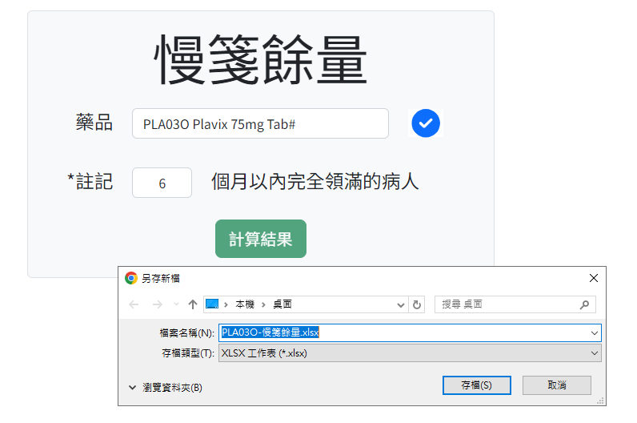

+++
title = '連續處方箋的餘量計算'
slug = '2023-11-refillable-prescription-consumption'
date = 2023-11-30T14:22:06+08:00
draft = true
isCJKLanguage = true
showToc = true
TocOpen = true
categories = ['Python','PHP']
tags = []
+++
民眾到醫院看診，醫師會依照民眾的病情開立藥品，給予「處方箋」，讓民眾到醫院的領藥處，或是醫院外的藥局領藥服用。

***
## 連續處方箋是什麼
連續處方箋全名為慢性病連續處方箋，又稱為慢箋，是臺灣健保提供給慢性病的病人使用同一處方藥品治療的處方箋，其他國家部分商業醫療保險也有提供這樣的方式，又稱為 Refill Prescription 。

也就是說，如果需要長期治療，例如說高血壓疾病，醫師可以開立最多 90 天的藥品，並請民眾分成每 30 天到藥局領一次藥，以減少掛號看醫生的頻率。

而且目前領取連續處方箋的藥品不用負擔任何費用，如果民眾家離醫院比較遠，也可以到社區健保特約藥局領藥，甚至有的藥局提供寄放處方箋提醒領藥的服務。


***
## 為什麼要算餘量
醫院醫師開立處方後，民眾可以自己選擇要留在原本醫院的藥局，或是外面的社區藥局領藥，但是 2023 年的現在因為各種戰爭，地震颶風等災難，影響了國外藥品的製造與運送航線導致缺藥事件層出不窮，加上臺灣健保給予廠商的健保藥價逐年下修，廠商無利潤可賺因而退出健保制度等因素，導致臺灣缺藥事件越演越烈，藥商基於先前與醫院的合約，只能優先提供醫療院所現貨，排擠了社區藥局。

這種情況下迫使民眾返回原本就醫的醫院領取藥品，就藥庫儲備藥品的立場，如果此時醫院的庫存也斷貨，民眾就會產生「奇怪？這藥單不是這間醫院給我的嗎？怎麼外面藥局領不到就算了，現在這間醫院也領不到了？」的心理，造成怨訴與對醫院的不信任，因此無論如何藥庫都得備齊已經開出去的連續處方箋餘量。

### 餘量都得備齊？
這個說法顯然有點狂妄，也不顧藥品庫存周轉率，以本院的藥品 Plavix 為例，庫存數量約為 250,000 顆左右，而使用藥品的人數有 8,100 多人，已經開出去的連續處方箋餘量維持在 410,000 顆上下，如果全部備齊可能會發生庫存位置放不下的狀態。

Plavix 是周轉率大的狀況，但如果其他藥品都以備齊的狀態儲備的話，在不缺藥的正常前提下，民眾不一定都會至醫院領藥，可能導致藥品庫存過多最終過期報銷。

民眾不一定都會至醫院領藥，更精準的說，民眾在醫院領第一次的藥後可以分成三種狀態：
1. 只在社區藥局領或乾脆不領。
2. 偶爾在社區藥局領，偶爾回醫院領藥。
3. 只在醫院領藥。

以精準化的角度看來，真的需要備齊的餘量是「只在醫院領藥」的**固定好客戶**的領藥量，其餘的民眾因為有不確定性，想來怨訴時醫院尚有一定的立場可以請民眾重新掛號更換其他藥品。

***
## 餘量計算規則與定義
### 資料來源
在先前的[前置作業](https://lamzy.net/2023-10-consumption-analyzation-preprocess/)中，資料其實尚包含 `refill` 的欄位，資料包含：
- 1/2：第1次，共2次
- 2/2：第2次，共2次
- 1/3：第1次，共3次
- 2/3：第2次，共3次
- 3/3：第3次，共3次
- AIR：持有機票可領取 2 次或 3 次
- N/A：非慢箋

但是原本的資料表設計：
```mysql
CREATE TABLE `consmp_字首` (
  `id` int(10) NOT NULL, /*自動產生的序號*/
  `pt` varchar(7) NOT NULL, /*病人病歷號*/
  `date` varchar(8) NOT NULL, /*領藥日期*/
  `drug` varchar(6) NOT NULL, /*藥品*/
  `total` varchar(20) NOT NULL, /*領藥數量*/
  `refill` varchar(10) NOT NULL /*慢箋資訊*/
)
```

必須再加入科別和醫師的資訊才有辦法描述**同一張**處方：
```mysql
CREATE TABLE `consmp_字首` (
  `id` int(10) NOT NULL, /*自動產生的序號*/
  `pt` varchar(7) NOT NULL, /*病人病歷號*/
  `date` varchar(8) NOT NULL, /*領藥日期*/
  `drug` varchar(6) NOT NULL, /*藥品*/
  `total` varchar(20) NOT NULL, /*領藥數量*/
  `refill` varchar(10) NOT NULL, /*慢箋資訊*/
  `subject` varchar(20) NOT NULL, /*科別*/
  `doctor` varchar(20) NOT NULL /*醫師*/
)
```
為此原本的資料必須重新批次建立。

### 資料區間
依照全民健康保險醫療辦法第23條規定，連續處方箋末次調劑之用藥末日不得受理。以本院為例，為了配合民眾固定星期回診，本院的處方箋為每月 28 天，因此連續處方箋的最後期限最大值就是 84 天。

> 法規中並無規定醫院處方每個月的天數，只有說明連續處方箋最多 90 天，而且必須分次調劑，並無說明每次調劑的天數。

### 固定好客戶的定義
連續處方箋最大值是 84 天，也就是說在兩個最大值 168 天內，穩定慢性病的民眾一定會產生 1 至 2 張連續處方箋，並且如果這幾張連續處方箋的 `refill` 欄位中出現了：
- 2/2：第2次，共2次
- 3/3：第3次，共3次
- AIR：持有機票可領取 2 次或 3 次

就可以視同固定好客戶，而其他領藥的民眾則視為普通客戶。可以先設定變數列表 (或陣列) 把固定好客戶的病歷號存起來。

### 餘量計算
在一種藥品中，單筆處方總量 × **剩下的慢箋次數** = 單筆餘量，而**剩下的慢箋次數**則是 `refill` 欄位中第二個數字 (共幾次) - 第一個數字 (第幾次) ，如果不符合這個格式的 ( AIR 或 N/A ) 則剩下的慢箋次數為 0 。

例如：
```csv
藥品代碼,病歷號,科別,醫師,日期,處方總量,refill
PLA001,AAA001,心臟內科,○○○,20230608,168,AIR
PLA001,AAA001,心臟內科,○○○,20230705,56,1/3
PLA001,AAA001,心臟內科,○○○,20230804,56,2/3
PLA001,AAA001,心臟內科,○○○,20230830,28,N/A
PLA001,AAA001,心臟內科,○○○,20230927,28,1/2
PLA001,AAA001,心臟內科,○○○,20231025,28,2/2
PLA001,AAA001,心臟內科,○○○,20231124,56,1/3
PLA001,AAA001,心臟內科,○○○,20231223,56,2/3
```

可以計算成：
```csv
藥品代碼,病歷號,科別,醫師,日期,處方總量,refill,單筆餘量
PLA001,AAA001,心臟內科,○○○,20230608,168,AIR,0
PLA001,AAA001,心臟內科,○○○,20230705,56,1/3,112
PLA001,AAA001,心臟內科,○○○,20230804,56,2/3,56
PLA001,AAA001,心臟內科,○○○,20230830,28,N/A,0
PLA001,AAA001,心臟內科,○○○,20230927,28,1/2,28
PLA001,AAA001,心臟內科,○○○,20231025,28,2/2,0
PLA001,AAA001,心臟內科,○○○,20231124,56,1/3,112
PLA001,AAA001,心臟內科,○○○,20231223,56,2/3,56
```

只列入 84 天的資料區間：
```csv
藥品代碼,病歷號,科別,醫師,日期,處方總量,refill,單筆餘量
PLA001,AAA001,心臟內科,○○○,20231025,28,2/2,0
PLA001,AAA001,心臟內科,○○○,20231124,56,1/3,112
PLA001,AAA001,心臟內科,○○○,20231223,56,2/3,56
```

而**同病歷號、同科別、同醫師的資料，可以視為同一張處方箋**，就實際層面而言，一個病人手上應該只會有一張處方箋可以領藥。以上面的例子來說，病人 `AAA001` 手上的連續處方箋，應該為心臟內科 ○○○ 醫師於 2023 年 11 月 24 日 開立的，並且於 2023 年 12 月 23 日領了第 2 次藥品，因此該病人手上僅有一張處方箋並剩下最後一次可以領藥，也就是餘量只有最後一筆的 56 。在程式實作時我們必須可以去除同病歷號、同科別、同醫師的重複值並保留最後一筆，也就是保留同一張處方的最後一次，以此加總計算。

去除重複值並保留最後一筆：
```csv
藥品代碼,病歷號,科別,醫師,日期,處方總量,refill,單筆餘量
PLA001,AAA001,心臟內科,○○○,20231223,56,2/3,56
```

***
## 程式實作
### Python
目標是**每天**產生出一個 `csv` 資料檔，這個資料檔可以供 php 讀取或由其他程式匯入，並且資料組成大概是這樣：
```csv
藥品代碼,總餘量,好病餘量
PLA001,404933,65435
文字,數字,數字
...,...,...
```

每個 python 的第一步，引入函式庫，如果沒有安裝的記得要先安裝：
```python
#!pip install pandas
import pandas as pd
#!pip install mysql-connector-python
import mysql.connector
#!pip install SQLAlchemy
from sqlalchemy import create_engine
```

設定參數：
```python
# 好病人區間 168 天
gooddate = (pd.to_datetime('today') - pd.Timedelta(days=168)).strftime('%Y%m%d')
# 資料區間 84 天
refilldate = (pd.to_datetime('today') - pd.Timedelta(days=84)).strftime('%Y%m%d')

# 暫時的藥品代碼，等等改成程式變數
code = 'PLA001'
```

查詢 MySQL 取得好病人區間 168 天的資料：
```python
engine = create_engine('mysql+mysqlconnector://帳號:密碼@位置:埠號/consmp')
sql = f"SELECT `pt`, `date`, `total`, `subject`, `doctor`, `refill` FROM `consmp_{capital}` WHERE `drug` = '{code}' AND `date` >= {gooddate} AND `refill` <> 'N/A'"
df = pd.read_sql(sql, engine)
```

將好病人的病歷號存在 list 中：
```python
goodpt = df.loc[(df['refill']=='2/2') | (df['refill']=='3/3') | (df['refill']=='AIR'), 'pt'].drop_duplicates().tolist()
```

重新將資料日期區間限定在 84 天內：
```python
df = df.loc[(df['date'].astype(int)>=int(refilldate)) & (df['refill']!='AIR')]
```

計算餘量，要注意使用 `.sum()` 之後的資料就不是 `DataFrame` 了，而是數值：
```python
if len(df):
    df['refill_this'] = df['refill'].str.split('/', expand=True)[0]
    # 第幾次

    df['refill_all'] = df['refill'].str.split('/', expand=True)[1]
    # 共幾次

    df['remains'] = df['refill_all'].astype(int) - df['refill_this'].astype(int)
    # 共幾次 - 第幾次

    df = df.drop(['refill','refill_this','refill_all'], axis=1)
    df = df.drop_duplicates(['pt','subject','doctor','total'], keep='last')
    # 去除同病歷號、同科別、同醫師的重複值並保留最後一筆

    total = (df['total'].astype(int) * df['remains']).sum()
    # 餘量 = ( 單筆處方總量 × 剩下的慢箋次數 ) 的所有單筆總和

    gooddf = df.loc[df['pt'].isin(goodpt)]
    # 只留下好病人的病歷號

    good = (gooddf['total'].astype(int) * gooddf['remains']).sum()
    # 好病人的餘量
else:
    total = 0
    good = 0
```

於是我們可以從 sql 查詢開始到輸出 total, good 結束包裝成一個自訂函式：
```python
def refillremains(code):
    sql = ...
    if len(df):
        ...
    else:
        ...
    return(total, good)
```

接著遍歷藥品品項檔，也可以先利用一些已知的方式排除不可能開立連續處方箋的品項，減少計算的時間：
```python
df = pd.read_csv('藥品品項檔.csv')
df = df[df['藥品分類'] != '透析液']
df = df[df['藥品分類'] != '顯影劑']
df = df[df['藥品分類'] != '化療注射藥品']
df = df[df['藥品分類'] != '管制一二級藥品']
...

with open(f'refill_{date}.csv', 'w') as txt:
    txt.write('code,total,good\n')

for _,row in df.iterrows():
    refillremains = refillremains(row['藥品代碼'])
    with open(f'refill_{date}.csv', 'w') as txt:
        txt.write(row['藥品代碼']+','+refillremains[0]+','+refillremains[1]+'\n')

```
最後再交給 Windows 排程器每天執行就可以了。

### PHP
網頁的目標則是讓使用者選擇特定藥品代碼後，下載剩餘慢箋的**所有病人明細**的 Excel 檔。

首先形成可供搜尋的 json 檔傳給頁面，並使用 jQuery 的 `$.each()` 方法輸出到頁面上：
```php
<?php
// 藥品名稱形成json列表讓使用者選取
$csv = "藥品品項檔.csv";
$drugs = [];
$file = fopen($csv, "r");
while ($row = fgetcsv($file)) {
    if ($row[0] == "藥品代碼") continue;
    $drugs[$row[0]] = $row[0]." ".$row[1];
}
fclose($file);
$drugs_json = json_encode($drugs, JSON_UNESCAPED_UNICODE);
```

當使用者選擇需要的藥品代碼後，表單會用 GET 的方式回傳到同一個頁面，因此可以使用 PHP 接 GET 的變數：
```php
if ((isset($_GET["drug"]))&&($_GET["drug"]!="")) {

$code = $_GET["drug"];
```

設定參數：
```php
$drug_name = substr($drugs[$code], 6);
$gooddate = date("Ymd", strtotime("-".strval($gooddef*28+1)." days"));
$refilldate = date("Ymd", strtotime("-84 days"));
$capital = (is_numeric(substr($code, 0, 1))) ? "0" : substr($code, 0, 1);
```

查詢 MySQL 取得好病人區間 168 天的資料：
```php
$conn = new PDO("mysql:host=位置;dbname=consmp;charset=utf8", "帳號", "密碼");
$conn->exec("SET NAMES utf8");
$records_good = $conn->query("SELECT `pt`, `date`, `total`, `subject`, `doctor`, `refill` FROM `consmp_$capital` WHERE `drug` = '$code' AND `date` >= $gooddate AND `refill` <> 'N/A' ORDER BY `date` ASC")->fetchAll(PDO::FETCH_ASSOC);
```

迭代查詢結果並計算：
```php
$goodpt = [];
$records = [];
foreach ($records_good as $record_good) {

    $remains = intval(substr($record_good["refill"], -1)) - intval(substr($record_good["refill"], 0 , 1));

    if (($record_good["refill"]=="2/2")||($record_good["refill"]=="3/3")||($record_good["refill"]=="AIR")) { 
        $goodpt[$record_good["pt"]] = true;
    }

    if (($record_good["date"]>=$refilldate)&&($record_good["refill"]!="機票")&&($remains > 0)) {
        //因為 php 沒有便利的 drop_duplicated keep last 方法，於是把資料塞到 index 迭代時就會只剩下最後一筆
        $drop_duplicates = $record_good["pt"].$record_good["total"].$record_good["subject"].$record_good["doctor"];

        $records[$drop_duplicates] = $record_good;
        $records[$drop_duplicates]["remains"] = $remains;
    }
}
```

資料以 Excel 檔下載：
```php
//資料排序
usort($records, function ($a, $b) {
    return $a["date"] <=> $b["date"];
});

$excel = "好病人標示\t病歷號\t就診日期\t領藥量\t剩餘次數\t科別\t醫師\n";
foreach ($records as $record) {
    //好病人標示
    if (array_key_exists($record["pt"], $goodpt)) {
        $excel .= "*\t";
    } else {
        $excel .= "\t";
    }

    $excel .= $record["pt"]."\t";
    $excel .= date("Y/m/d", strtotime($record["date"]))."\t";
    $excel .= $record["total"]."\t";
    $excel .= $record["remains"]."\t";
    $excel .= $record["subject"]."\t";
    $excel .= $record["doctor"]."\n";
}
header("Content-type: application/vnd.ms-excel");
header("Content-Disposition: attachment; filename=$code-慢箋餘量.xlsx");
exit($excel);
```

這邊使用最簡單的 Excel 輸出方式，因為不須變更格式或進行更複雜的操作，不需要使用 php 的套件。

最後在寫個簡單的操作介面就完成了。

