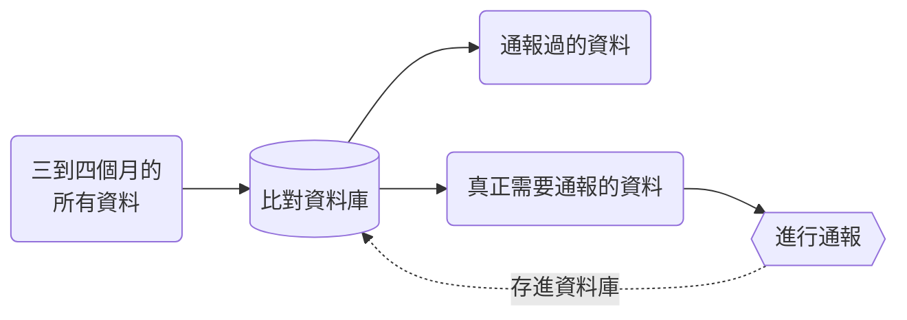
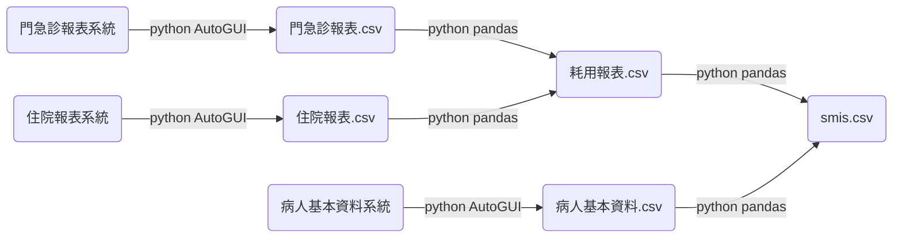
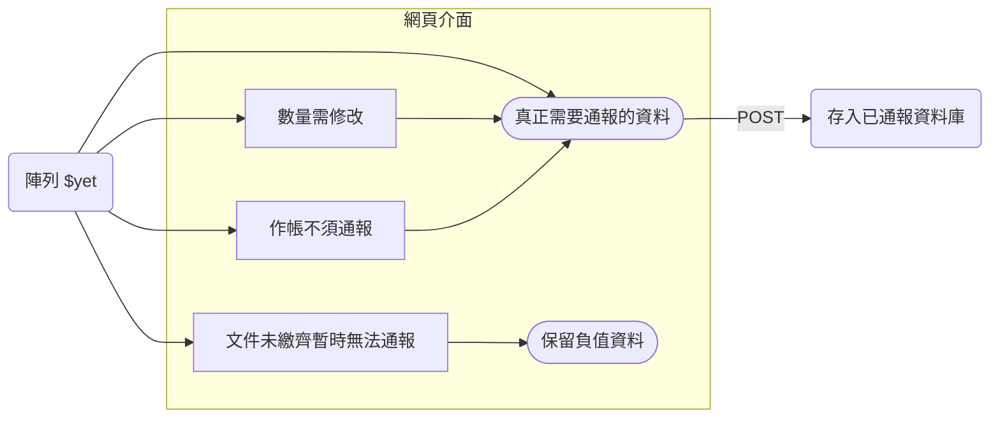

+++
title = '智慧防疫物資管理系統：紀錄'
slug = '2023-12-mrdss-record'
date = 2023-12-08T14:11:53+08:00
draft = false
isCJKLanguage = true
showToc = true
TocOpen = true
mermaid = true
categories = ['PHP','Python']
tags = ['PHP','Python','COVID-19','SMIS','Paxlovid','Molnupiravir','Tamiflu','智慧防疫物資管理系統','CDC','pandas','pyAutoGUI','Remdesivir','Evusheld','Relenza','array_diff','cumsum','array_merge']
+++
2019 年 COVID-19 爆發，再經過一兩年以後治療藥品包含 Paxlovid 和 Molnupiravir 紛紛問世，臺灣疾管署在 2022 年 5 月由國家公費採購並順利進口藥品，配發到各醫療院所讓確診和危急的病人快速獲得治療。

為了控管使用情形與掌握庫存，疾管署要求各醫療院所使用[智慧防疫物資管理系統](https://smis.cdc.gov.tw/smis/)回報病人資料與目前院所的庫存。這一套系統是自 2009 年臺灣爆發 H1N1 新型流感時，疾管署配發 Tamiflu 和 Relanza 就開始使用的系統，而如今隨著未知疾病的普及，未來不只 H1N1 、 COVID-19 ，只要使用到公費藥品，醫療院所可能就需要使用該系統回報病人和藥品數量。

這件事在各醫療院所可能由不同的行政人員來負責，但是本院卻落到了藥庫藥師身上 ^^ 。
***
## 流程規劃與困境
### 傳統通報方式
依照疾管署規定，院所需要**每天**上傳使用的紀錄，理想化來看，疾管署應該是希望當天晚上 23:59 時，院所能夠上傳當天 00:00 至 23:59 的每位病人資料。小型診所或許有辦法辦到，但是醫院因為工時受到勞基法限制，行政藥師下班後仍然有醫師看診、或包含週六日國定假日等等醫師都有可能開出公費藥品。

因此實務上，本院都是累積三四天的資料一併通報，如此一來就會遇到一個問題，必須記得上次通報的日期，才有辦法找到兩個日期區間的資料，避免重複通報。

然而以日期區間的資料作通報，其實不是好辦法，之前有說過醫師和帳務系統可以更改前幾日處方，如果恰好改了日期區間之前的資料，就會發生錯漏或重複的情形。

舉個例子：病人 15 日經由急診入院後，因為狀況不好，醫師決定吊點滴觀察個兩天，最終病人在 17 日恢復出院，並開立藥品回家使用。

這樣的資料因為帳務問題，要等到 17 日的報表會呈現病人 15 日的耗用資料， 15 日或 16 日的報表都不會有。假如藥師 16 日進行通報，因為 17 日才有資料，所以藥師當次不會通報該病人。而下次的通報日期區間是從 16 日開始，但因為病人資料是 15 日，資料不在區間中所以也不會通報。如此一來就產生錯漏。

### 真正需要通報的資料
因此比較嚴謹的通報資料篩選應該是不要只抓限定的日期區間，因為會有修改處方或是帳務調整的情況，資料日期區間需要更大一點，例如三到四個月，然後建立**已通報資料庫**將資料進行篩選：

經過比對之後可以得到尚未通報過資料，也就是真正需要通報的資料，完成通報後，再把這些資料存回已通報資料庫中以利下次的比對。

>受限於健保申報日期，可變動的處方通常會在下一個月的 5 日鎖定，但為求慎重起見，可以往前取三到四個月的日期區間。
***
## 已通報資料庫設計
資料庫欄位會需要跟智慧防疫物資管理系統需要的欄位一致，包含：
- 病人姓名
- 病人性別
- 病人出生年月日
- 病人身份證字號
- 病人國籍
- 給藥日期
- 給藥日數
- 藥品名稱
- 藥品批號
- 使用原因
- ...其他為選填型項目，可為空白值

非常多的欄位，實際上與資訊室溝通時，因為病人基本資料和當次開立資料分別為兩種系統，在權衡 python 的自動滑鼠操作能力下，僅留下了比較重要的欄位作資料比對和資料呈現，其他資訊室無法提供的資料，例如：藥品批號；或是無法使用 python 的自動滑鼠抓到的資料，例如：使用原因，就不列入資料庫中，需要時再以手動操作院內系統就可以了，花費的時間並不會比 python 的自動滑鼠還久。

最後欄位設計為：
```mysql
CREATE TABLE `smis` (
  `id` int(11) NOT NULL,                /*自動遞增序號*/
  `medicine` varchar(20) NOT NULL,      /*藥品名稱*/
  `ptid` varchar(20) NOT NULL,          /*病人身份證字號*/
  `ptname` varchar(50) DEFAULT NULL,    /*病人姓名*/
  `hosid` varchar(10) DEFAULT NULL,     /*病人醫院病歷號，因為有些病人身分證字號可能會異動*/
  `ptbirth` int(11) DEFAULT NULL,       /*病人出生年月日，YYYYMMDD*/
  `reportdate` int(11) NOT NULL,        /*使用藥品日期*/
  `insertdate` int(11) NOT NULL,        /*插入資料日期*/
  `quantity` int(11) NOT NULL,          /*使用藥品數量*/
  `notes` varchar(50) DEFAULT NULL      /*其他備註*/
) ENGINE=InnoDB DEFAULT CHARSET=utf8;
```

其中留下了病人身分證字號，還必須多留一欄病人醫院病歷號，以避免**身分證字號可能會異動**的情形，例如，病人可能是路倒無意識的狀況，被送進醫院建立資料時無法得知身分證字號；或是病人一開始的身分證字號欄位填入的是護照號碼或是[統一證號](https://www.moi.gov.tw/News_Content.aspx?n=4&s=211031)，後來成為臺灣國籍變更成身分證字號。

***
## 資料比對：差集 (difference set)
與先前一樣，資料是利用 python 的 AutoGUI 模擬滑鼠定位座標，操作院內程式匯出 csv 檔案，經過 python 的 pandas 匯入門診和住院各個藥品的資料，並且將資料清理整併後，輸出成一個 csv 檔。


目前現在的公費抗病毒藥品總共有 8 種，而本院依藥品費別不同區分總共 12 個藥品代碼：
- Paxlovid Tablet
- Molnupiravir Capsule
- Remdesivir Vial
- Evusheld Vial
- Tamiflu Capsule
- Eraflu Capsule
- Relenza Rotadisk
- Oseltamivir Oral Suspension

因為通報藥品的人不是我，因此考慮使用 php 網頁製作介面讓使用者確認資料比對。

在 php 中兩個陣列 (array) 的差集運算可以使用 `array_diff()` ：
```php
<?php
// 定義藥品代碼和藥品名稱
$medicine_code = [
    "PAX01O"=>"Paxlovid",
    "PAX02O"=>"Paxlovid",
    "MOL01O"=>"Molnupiravir",
    "MOL02O"=>"Molnupiravir",
    "EVU01I"=>"Evusheld",
    "EVU02I"=>"Evusheld",
    "REM02I"=>"Remdesivir",
    "REM05I"=>"Remdesivir",
    "TAM03O"=>"Tamiflu",
    "ERA01O"=>"Eraflu",
    "REL01E"=>"Relenza",
    "OSE01S"=>"Oseltamivir"
];

// 讀入三至四個月的所有資料
$file = fopen("doc/smis.csv", "r");
//column：藥品代碼,病人身份證字號,病人姓名,使用日期,使用數量,病人生日,病歷號碼
$consume = [];
while ($row = fgetcsv($file)) {
    $consume[] = $medicine_code[$row[0]]+$row[3]+$row[6];
    //將 [ 藥品 + 使用日期 + 病人病歷號 ] 合併為一個值
}

// 查詢已通報資料庫
$dsn = "mysql:host=伺服器位置;dbname=資料庫名稱;charset=utf8";
$conn_user = "帳號";
$conn_pwd = "密碼";
$conn = new PDO($dsn, $conn_user, $conn_pwd);
$conn -> exec("SET NAMES utf8");
$quota = $conn->query("SELECT CONCAT(`medicine`,`reportdate`,`hosid`) FROM `smis`")->fetchAll(PDO::FETCH_NUM);
//這邊也將 [ 藥品 + 使用日期 + 病人病歷號 ] 併為一個值

// 比對陣列，返回須通報資料
$need_to_report = array_diff($consume, $quota);

```
要注意 `array_diff(A, B)` 的函數跟集合差集一樣是具有方向性的， 計算結果會是 {A} - {B}：


所以需要通報的資料是所有的消耗資料 {$consume} 和已經通報過的資料 {$quota} 的差集，並且要留下 {$consume} 的那一邊，所以是 {$consume} - {$quota} ： `array_diff($consume, $quota)` ，而 `array_diff()` 比較對象是陣列中的 values ，為了唯一的結果，我決定將 [ 藥品 + 使用日期 + 病人病歷號 ] 合併為一個值做為比較的依據。

> `{ }` 符號表示一個集合。

***
## 資料比對：累加 (cumsum)
然而單純使用差集的方式比對資料只適合門診的資料，因為現行的住院藥品是以 unit dose 進行，也就是藥品消耗會被拆成一天一天份，以藥品 **Molnupiravir** 當作例子，同一天開始使用藥品的門診及住院病人資料會這樣呈現：

```csv
來源,日期,天數,數量
門診,20231215,5,40
住院,20231215,1,8
住院,20231216,1,8
住院,20231217,1,8
住院,20231218,1,8
住院,20231219,1,8
```
這樣的例子中，住院的資料就會重複通報四次。

如果拿掉了日期的合併值，改以**藥品名稱 + 病歷號**的合併值比對，可以順利克服上面住院的資料，但是如果碰到因為**重複感染**在同一個月使用兩次藥品的情形就不會通報了：
```csv
來源,日期,天數,數量
門診,20231202,5,40
門診,20231225,5,40
```

更麻煩的是結合以上兩種，更甚者還有其他想像不到的狀況：
```csv
來源,日期,天數,數量
住院,20231205,1,4   //藥品數量開立錯誤
住院,20231205,1,4   //補開數量
住院,20231206,1,8
住院,20231207,1,8
住院,20231208,1,8
住院,20231209,1,8
住院,20231221,1,16  //藥品數量開立錯誤
住院,20231221,1,-16 //整筆處方刪除
住院,20231221,1,8   //開正確處方
住院,20231222,1,8
住院,20231223,3,24  //出院
```

所以需要一套更好的方法來處理藥品的數量。

用上面的例子繼續延伸，假設我們有以下的**已通報資料**：
```csv
通報日期,數量
20231109,40
20231210,40
```
> 藥品 Molnupiravir 每次通報量為 40 粒。

有以下的**所有的耗用資料**：
```csv
耗用日期,數量
20231109,40
20231205,4
20231205,4
20231206,8
20231207,8
20231208,8
20231209,8
20231221,16
20231221,-16
20231221,8 
20231222,8
20231223,8
```
>值得注意的是最後使用的藥品數量總共 24 粒，但因為操作日期是 20231223 ，導致後面兩天份的藥品未呈現在報表中。

我們可以先將兩張報表合併起來，依照日期排序，然後將耗用資料的數值**加上負號**：
```csv
類型,日期,數量
耗用,20231109,-40
通報,20231109,40
耗用,20231205,-4
耗用,20231205,-4
耗用,20231206,-8
耗用,20231207,-8
耗用,20231208,-8
耗用,20231209,-8
通報,20231210,40
耗用,20231221,-16
耗用,20231221,-(-16)
耗用,20231221,-8 
耗用,20231222,-8
耗用,20231223,-8
```

將上表依照日期排序進行累加：
```csv
類型,日期,數量,累加值
耗用,20231109,-40,-40
通報,20231109,40,0
耗用,20231205,-4,-4
耗用,20231205,-4,-8
耗用,20231206,-8,-16
耗用,20231207,-8,-24
耗用,20231208,-8,-32
耗用,20231209,-8,-40
通報,20231210,40,0
耗用,20231221,-16,-16
耗用,20231221,16,0
耗用,20231221,-8,-8
耗用,20231222,-8,-16
耗用,20231223,-8,-24
```

如果最後一筆資料為負值就是需要通報的資料！

剛剛說還有兩天份的藥品沒吃完，來看看通報之後的結果：

```csv
類型,日期,數量,累加值
耗用,20231223,-8,-24
通報,20231223,40,16
耗用,20231224,-8,8
耗用,20231225,-8,0
```
消耗完畢，最後一筆結果不為 0 不須通報。

　

如果是重複感染的情形：
```csv
類型,日期,數量,累加值
消耗,20231202,-40,-40
消耗,20231223,-40,-80
```

通報了一次後：
```csv
類型,日期,數量,累加值
消耗,20231202,-40,-40
消耗,20231223,-40,-80
通報,20231223,40,-40
```

通報完成後，最後一筆仍為負值，因此必須再次通報：
```csv
類型,日期,數量,累加值
消耗,20231202,-40,-40
消耗,20231223,-40,-80
通報,20231223,40,-40
通報,20231223,40,0
```
>但同一天通報兩次可能會引起疾管署的注意，只能在備註上解釋消耗日期是 20231202 ，有可能是當時忘記通報。

　

所以使用**累加**的方式來處理住院的資料以及重複消耗的問題，比起使用差集比對資料，會是一個比較穩健的方法。
***
## 程式實作
如同前面的程式，先各自引入陣列，這次不能把值合併在一起，耗用資料的數值**加上負號**，另外要注意**耗用日期**與**通報日期**的欄位名稱要調整一致：
```php
<?php
// 定義藥品代碼和藥品名稱
$medicine_code = [
    ...
];

// 讀入三至四個月的所有資料
$file = fopen("doc/smis.csv", "r");
//column：藥品代碼,病人身份證字號,病人姓名,使用日期,使用數量,病人生日,病歷號碼
$consume = [];
while ($row = fgetcsv($file)) {
    $consume[] = [
        "medicine" => $medicine_code[$row[0]],
        "ptid" => $row[1],
        "ptname" => $row[2],
        "date" => 0-$row[3],    /*加上負號*/
        "quantity" => $row[4],
        "ptbirth" => $row[5],
        "hosid" => $row[6]
    ];
}

// 查詢已通報資料庫
$dsn = "mysql:host=伺服器位置;dbname=資料庫名稱;charset=utf8";
$conn_user = "帳號";
$conn_pwd = "密碼";
$conn = new PDO($dsn, $conn_user, $conn_pwd);
$conn -> exec("SET NAMES utf8");
$quota = $conn->query("SELECT `medicine`,`ptid`,`ptname`,`reportdate` AS `date`,`quantity`,`ptbirth`,`hosid` FROM `smis`")->fetchAll(PDO::FETCH_ASSOC);
/*reportdate欄位名稱改為date*/
```

　

合併兩個陣列並且排序。上方的例子是同一藥品、同一病歷號的情形，所以實際上的排序順序應該是：
1. 藥品名稱：升冪或降冪皆可
2. 病歷號：升冪或降冪皆可
3. 日期：升冪排序
```php
$details = array_merge($consume, $quota);
usort($details, function ($a, $b) {
    return [$a["medicine"],$a["ptid"],$a["date"]] <=> [$b["medicine"],$b["ptid"],$b["date"]];
});
```

　

接著依照同一藥品、同一病歷號分組累加：
```php
$thisgroup = [];
$prevgroup = [];
foreach ($details as $key=>$row) {
    $thisgroup = [$row["medicine"],$row["ptid"]];
    if ($prevgroup != $thisgroup) {
        $details[$key]["remains"] = $details[$key]["quantity"];
        $prevgroup = [$row["medicine"],$row["ptid"]];
    } else {
        $details[$key]["remains"] = $details[$key-1]["remains"] + $details[$key]["quantity"];
        $prevgroup = [$row["medicine"],$row["ptid"]];
    }
}
```

再取出同一藥品、同一病歷號最後一筆資料，並且挑出負值塞進新的陣列中：
```php
$yet = [];
$thisgroup = [];
$prevgroup = [];
foreach ($details as $row) {
    if ($row["remains"]<0) {
        //避免住院的資料重複跑出
        $thisgroup = [$row["medicine"],$row["ptid"]];
        if ($prevgroup != $thisgroup) {
            $prevgroup = [$row["medicine"],$row["ptid"]];
            //通報數量預設值
            switch ($row["medicine"]) {
                case "Paxlovid":
                    $quantity = 10;
                    break;
                case "Molnupiravir":
                    $quantity = 40;
                    break;
                case "Remdesivir":
                    $quantity = intval($row["quantity"])==0 ? 6 : intval($row["quantity"]);
                    //報表中應該要有申請數量，以申請數量當作通報數量，不然預設為 6 支
                    break;
                case "Tamiflu":
                case "Eraflu":
                    if (0-intval($row["quantity"])>1) {
                        $quantity = 0-intval($row["quantity"]);
                    } else {
                        $quantity = (0-intval($row["quantity"]))*10;
                    }
                    //先判斷$row["quantity"]是不是整數，如果是整數，可能就是門診病人，因此可以直接通報該數量；如果不是整數，可能是住院病人，通報為10倍的用量。
                    break;                
                case "Evusheld":
                case "Oseltamivir":
                case "Relenza":
                    $quantity = 0-intval($row["quantity"]);
                    break;
            }
            $yet[] = [
                "medicine" => $row["medicine"],
                "ptid" => $row["ptid"],
                "ptname" => $row["ptname"],
                "hosid" => $row["hosid"],
                "ptbirth" => $row["ptbirth"],
                "reportdate" => $row["date"],
                "quantity" => $quantity,
                "notes" => "",
            ];
        }
    }
}
```

陣列 `$yet` 為需要通報的資料，可以將該陣列顯示在網頁介面上，讓使用者調整數量或是決定要不要通報等等，之後再將真正需要通報的資料用 POST 的方法存入通報資料庫。

網頁介面的部份下一篇在討論了。
