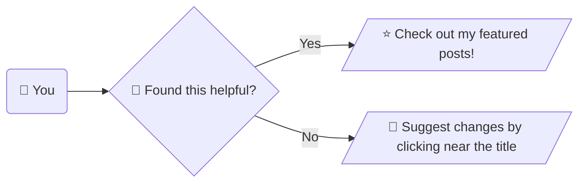

+++
title = '智慧防疫物資管理系統：紀錄'
slug = '2023-12-mrdss-record'
date = 2023-12-08T14:11:53+08:00
draft = true
isCJKLanguage = true
showToc = true
TocOpen = true
mermaid = true
categories = ['PHP', 'Python']
tags = []
+++
2021 年 COVID-19 爆發，而後抗 COVID-19 用藥包含 Paxlovid 和 Molnupiravir 紛紛問世，於是在 2022 年 5 月臺灣疾管署統一購買藥品後，配發到各醫療院所讓病人快速獲得治療。

為了控管使用情形與掌握庫存，疾管署要求各醫療院所使用[智慧防疫物資管理系統](https://smis.cdc.gov.tw/smis/)回報病人資料與目前院所的庫存。這一套系統是從 2009 年臺灣爆發 H1N1 新型流感的時候，疾管署統一配發 Tamiflu 和 Relanza 時就開始使用的系統，而如今隨著未知疾病的普及，未來不只 H1N1 或是 COVID-19 ，只要使用到公費藥品，醫療院所就需要使用該系統回報病人和藥品數量。

這件事在各醫療院所可能由不同的行政人員來負責，但是本院卻落到了藥庫藥師身上 ^^ 。
***
## 流程規劃與困境
### 傳統通報方式
依照疾管署規定，院所需要每天上傳使用的紀錄，理想化來看，疾管署應該是希望當天晚上 23:59 時，院所能夠上傳當天 00:00 至 23:59 的每位病人資料。小診所或許有辦法辦到，但是醫院在實務上因為上班時間受到勞基法限制，下班後仍然有醫師看診、或包含週六日國定假日等等醫師都有可能開出公費藥品。

因此實務上，本院都是累積三四天的資料一併通報，如此一來就會遇到一個問題，必須記得上次通報的日期，才有辦法找到兩個日期區間的資料作通報，以避免重複通報。

然而以日期區間的資料作通報，其實不是好辦法，之前有說過醫師和帳務系統具有更改前幾日處方的權利，如果恰好改了日期區間以外的資料，就會發生錯漏或重複的情形。

舉個例子：病人 15 日經由急診入院後，因為狀況不好，醫師決定吊點滴觀察個兩天，最終病人在 17 日恢復出院，並開立藥品回家使用。這樣的資料因為帳務問題，要等到 17 日的報表會呈現病人 15 日的耗用資料， 15 日或 16 日的報表都不會有。假如藥師 16 日進行通報，因為 17 日才有資料，所以藥師當次不會通報該病人。而下次的通報日期區間是從 16 日開始，但因為病人資料是 15 日，所以也不會通報。
### 真正需要通報的資料
因此比較嚴謹的通報資料篩選應該是不要只抓限定的日期區間，因為會有修改處方或是帳務調整的情況，資料日期區間需要更大一點，例如三到四個月，然後建立**已通報資料庫**將資料進行篩選：

### 住院病人資料
***
## 已通報資料庫設計
***
## 實際需要通報資料
