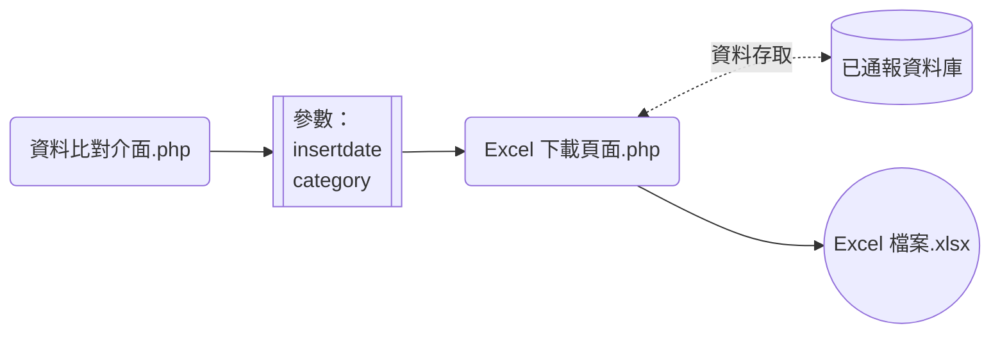
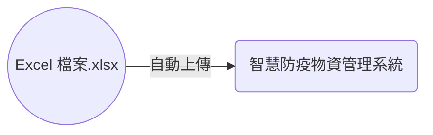

+++
title = '智慧防疫物資管理系統：通報'
slug = '2023-12-smis-report'
date = 2023-12-19T14:12:43+08:00
draft = true
isCJKLanguage = true
showToc = true
TocOpen = true
categories = ['PHP']
tags = []
[cover]
image = 'xlsx.png'
+++
前一篇文章提到，我們將三到四個月的資料匯出後使用已通報資料庫篩選比對，形成真的需要通報的資料，並且存回已通報資料庫。

已目前的通報病人數量來說，每天最少通報 1 筆，最多則有通報 98 筆的狀況，想當然爾無法逐筆點按疾管署[智慧防疫物資管理系統](https://smis.cdc.gov.tw/smis/)網站的表單，還好網站提供多筆批次匯入的方法。



所以接下來我們要利用 php 把資料庫中的資料存成 xlsx 檔，下載後手動匯入網頁中。
***
## 流程規劃
需要通報的資料在規劃中完成通報後，會增加一個 `insertdate` 欄位並將資料存回資料庫中，因此只需要利用該欄位即可把需要通報的資料查出來。

在[智慧防疫物資管理系統](https://smis.cdc.gov.tw/smis/)中對於藥品其實還分成三大類，同一大類的藥品可以同時寫在一個 Excel 檔中進行通報。

流程規劃長這個樣子，獨立開一頁出來，或是直接作在同一頁上也可以，當接到變數時，撈資料庫中的指定 `insertdate` ，並回傳資料下載：


程式可以這樣寫：
```php
<?php
// 智慧防疫物資管理系統的分類
$smis_category = [
    "流感抗病毒藥劑" => ["Tamiflu", "Eraflu", "Oseltamivir", "Relenza"],
    "防疫藥品器材" => ["Evusheld", "Remdesivir"],
    "新興傳染病用藥" =>  ["Paxlovid", "Molnupiravir"]
];

// 取得 "insertdate" 和 "category" 的 URL 變數
$insertdate = $_GET["insertdate"];
$sql = "SELECT * FROM `smis` WHERE `insertdate` = '$insertdate'";
if ((isset($_GET["category"]))&&($_GET["category"]!="")) {
    $category = $_GET["category"];
    if ($category=="新興傳染病用藥") {
        $sql .= " AND (`medicine` = 'Paxlovid' OR `medicine` = 'Molnupiravir')";
    } elseif ($category=="防疫藥品器材") {
        $sql .= " AND (`medicine` = 'Remdesivir' OR `medicine` = 'Evusheld')";
    } elseif ($category=="流感抗病毒藥劑") {
        $sql .= " AND (`medicine` = 'Tamiflu' OR `medicine` = 'Eraflu' OR `medicine` = 'Relenza')";
    }
}

// 查詢資料庫取得資料陣列
$dsn = "mysql:host=伺服器位置;dbname=資料庫名稱;charset=utf8";
$conn_user = "帳號";
$conn_pwd = "密碼";
$conn = new PDO($dsn, $conn_user, $conn_pwd);
$conn -> exec("SET NAMES utf8");
$records = $conn->query($sql)->fetchAll(PDO::FETCH_ASSOC);
```
***
## 直接在瀏覽器中顯示並下載
有了資料之後，就要用資料開始製作 xlsx 檔，最簡單的寫法是以 `\t` 當作欄位分隔線， `\n` 換行，直接將內容輸出在 php 變數中後，使用 `exit()` 方法印在瀏覽器上，再加入 `Content-type` 和 `Content-Disposition` 讓瀏覽器知道以下的內容是必須下載的：
```php
// 欄位名稱：欄位會因為 category 不同而有變更
$excel = "姓名\t出生年月日YYYY/MM/DD\t身分證字號\t給藥日期YYYY/MM/DD\t投藥劑量\t物資項目代碼\t批號\t用藥對象\n";

// 資料
foreach ($records as $record) {
    $excel .= $record["ptname"]."\t";
    $excel .= date("Y/m/d", strtotime($record["ptbirth"]))."\t";
    $excel .= $record["ptid"]."\t";
    $excel .= $record["reportdate"]."\t";
    $excel .= $record["quantity"]."\t";
    $excel .= "\t";
    $excel .= "\t";
    $excel .= "\t";
    $excel .= "\n";
}
// 下載成 Excel 檔
header("Content-type: application/vnd.ms-excel");
header("Content-Disposition: attachment; filename=.xlsx");
exit($excel);
```
然而利用瀏覽器直接下載的方法，欄位的格式會在第一次由電腦中的 Excel 開啟檔案時依照欄位的型態自行判斷，也就是說日期的欄位雖然是 YYYY/MM/DD ，Excel 軟體可能判斷為日期或字串，因此在上傳到智慧防疫物資管理系統時就會因為格式不相符而被系統拒絕。

***
## 使用套件製作 xlsx 檔案
為了避免電腦裡的 Excel 軟體幫我們決定格式，比較好的方法是製作 xlsx 檔案的時候就要指定格式，但是單純用瀏覽器下載的方式並無法作到這種複雜的操作，因此需要利用 php 的套件 (packages) 來幫忙我們完成。
### 安裝 Composer
當我們使用 Python 需要更進階的操作或是方法時，我們會去搜尋有沒有已經寫好的函式庫可供引入，例如 pandas 、 PIL 等等。我們會在終端機使用指令將函式庫安裝在本地端：
```powershell
pip install pandas
pip install Pillow
...
```

接著在 py 程式裡面使用以下程式引入安裝好的函式庫：
```python
import pandas as pd
from PIL import Image
```

php 也一樣具有安裝函式庫及引入函式庫的方法： Composer 就是一個類似 pip 的程式，因為 php 不像 python 一開始安裝就先把 pip 包含在 python 的安裝檔之中，所以必須到 [Composer](https://getcomposer.org/) 的官方網站去下載軟體並且安裝，我的環境是 Windows 就直接使用 Windows Installer 即可。

安裝過程中要告訴 Installer php.exe 的位置，以我使用 xampp 的開發環境來說，位置通常在 `安裝目錄\xampp\php\` 底下。不過使用 Windows 安裝 php 的時候，大部分預設都會加入環境變數，所以 Installer 通常都可以自己找到。

安裝完畢之後可以在 cmd 等 CLI 視窗中輸入 `composer` 來確認是否有安裝成功，如果出現了以下的歡迎畫面，表示安裝成功了：
```powershell
   ______
  / ____/___  ____ ___  ____  ____  ________  _____
 / /   / __ \/ __ `__ \/ __ \/ __ \/ ___/ _ \/ ___/
/ /___/ /_/ / / / / / / /_/ / /_/ (__  )  __/ /
\____/\____/_/ /_/ /_/ .___/\____/____/\___/_/
                    /_/
Composer version 2.6.5 2023-10-06 10:11:52
```
### 安裝套件 phpoffice/phpspreadsheet
接著需要安裝套件，不過因為開發環境的關係，我通常不會像 python 直接以 `pip install` 的方式安裝在全域 (電腦主機) 裡面，而是伺服器根目錄底下另外開資料夾，然後在該資料夾中安裝套件。例如：
```
.
├─ smisdl
│   └─ smisdl.php 
├─ 其他網頁
│
...
```
在瀏覽器中輸入 `http://localhost/smisdl/smisdl.php` 便可以指向該網頁。

在 `smisdl` 資料夾底新增一個 `composer.json` 檔案，告訴 composer 這個資料夾底下要安裝的套件名稱：
```json
{
    "require": {
        "phpoffice/phpspreadsheet": "^1.29"
    }
}
```

將 cmd 或 Powershell 等  CLI 視窗的路徑移動到該資料夾，並輸入 composer 安裝的指令：
```powershell
C:\> cd C:\網頁根目錄\smisdl
C:\網頁根目錄\smisdl> composer install
```

這一個指令會去尋找目錄底下的 `composer.json` 檔案，並安裝檔案中的套件，安裝結束後可以看到資料夾底下多了一個 `composer.lock` 以及一個 `vendor` 資料夾，表示已經成功安裝套件。

另外也可以不新增 `composer.json` ，直接在目錄底下輸入：
```powershell
C:\網頁根目錄\smisdl> composer require phpoffice/phpspreadsheet
```
也可以達到一樣的效果。

### 使用套件
接著在 php 網頁中引入套件，就像是 python 裡面的 `import` ，不過要引入的東西可能要參考各套件的[說明](https://phpspreadsheet.readthedocs.io/en/latest/)：
```php
<?php
require "vendor/autoload.php";
use PhpOffice\PhpSpreadsheet\Spreadsheet;
use PhpOffice\PhpSpreadsheet\Writer\Xlsx;
```

跟上面一樣先將資料查詢出來：
```php
// 智慧防疫物資管理系統的分類
$smis_category = [
    "流感抗病毒藥劑" => ["Tamiflu", "Eraflu", "Oseltamivir", "Relenza"],
    "防疫藥品器材" => ["Evusheld", "Remdesivir"],
    "新興傳染病用藥" =>  ["Paxlovid", "Molnupiravir"]
];

// 取得 "insertdate" 和 "category" 的 URL 變數
$insertdate = $_GET["insertdate"];
$sql = "SELECT * FROM `smis` WHERE `insertdate` = '$insertdate'";
if ((isset($_GET["category"]))&&($_GET["category"]!="")) {
    $category = $_GET["category"];
    if ($category=="新興傳染病用藥") {
        $sql .= " AND (`medicine` = 'Paxlovid' OR `medicine` = 'Molnupiravir')";
    } elseif ($category=="防疫藥品器材") {
        $sql .= " AND (`medicine` = 'Remdesivir' OR `medicine` = 'Evusheld')";
    } elseif ($category=="流感抗病毒藥劑") {
        $sql .= " AND (`medicine` = 'Tamiflu' OR `medicine` = 'Eraflu' OR `medicine` = 'Relenza')";
    }
}

// 查詢資料庫取得資料陣列
$dsn = "mysql:host=伺服器位置;dbname=資料庫名稱;charset=utf8";
$conn_user = "帳號";
$conn_pwd = "密碼";
$conn = new PDO($dsn, $conn_user, $conn_pwd);
$conn -> exec("SET NAMES utf8");
$records = $conn->query($sql)->fetchAll(PDO::FETCH_ASSOC);
```

開始製作 xlsx 檔案，首先是整個檔案的設定：
```php
$spreadsheet = new Spreadsheet();
$spreadsheet->getDefaultStyle()->getFont()->setName("微軟正黑體");
$spreadsheet->getDefaultStyle()->getFont()->setSize(12);
//設定字體與字體大小
$spreadsheet->getDefaultStyle()->getNumberFormat()->setFormatCode("@");
//設定每一個儲存格為通用格式 @
```

再來是一張工作頁 Work Sheet 的裡面：
```php
$sheet = $spreadsheet->getActiveSheet()->setTitle("用藥個案");
//頁籤名稱
$sheet->setCellValue("A1", "姓名");
//在指定的儲存格 A1 輸入文字：姓名
$sheet->setCellValue("F1", "給藥日期\nYYYY/MM/DD");
...
// 可以利用跳脫字元 \n 來達到儲存格內換行的效果
foreach ($records as $key=>$value) {
    $row = $key+2;
    $sheet->setCellValueByColumnAndRow(1, $row, $value["ptname"]);
    //如果無法指定為 A1 等格式，可以利用這個方法指定 Column 和 Row 序數的儲存格中輸入文字
    ...
}
```
最後輸出檔案後丟回瀏覽器進行下載：
```php
$writer = new Xlsx($spreadsheet);
$writer->save($filename);
//套件儲存檔案
$content = file_get_contents($filename);
header("Content-Disposition: attachment; filename=".$filename);
unlink($filename);
exit($content);
//瀏覽器下載檔案
```
如此就可以達成，當丟了兩個參數給該頁面時，可以產生使用 php 套件產生事先指定每一儲存格格式的 xlsx 檔。另外套件也能作到指定每一儲存格的大小、顏色格式、文字對齊、框線、合併儲存格，甚至可以直接在儲存格裡面輸入 Excel 的公式結果，十分強大。只是我這邊就沒有這種用途了，如果有需要的需要多翻一下套件的[說明](https://phpspreadsheet.readthedocs.io/en/latest/)了。

***
## 為什麼還要手動匯入？

最後一定會想要自動化上傳到智慧防疫物資管理系統，畢竟以使用者體驗來看，同一個頁面可以直接完成的作業，一定遠遠勝過還要再開第二或第三頁面。

雖然是這樣想，但是疾病管制署的網頁是利用醫事人員晶片卡登入，於是該機構的網站[外包商](https://www.changingtec.com/)要求使用者電腦必須額外安裝系統讀卡元件，接著使用讀卡機設備讀取晶片卡、輸入認證碼後才能完成登入。

依我目前的技術，還無法做到直接用 php 或 python 自動化這些步驟，可能也有些認證的方法需要破解，就留給未來的我吧。
