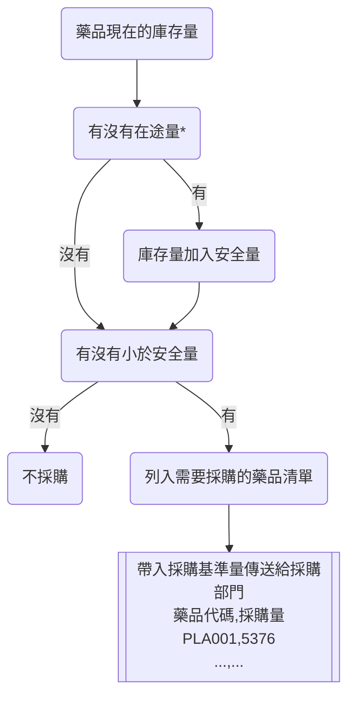

+++
title = '藥品採購需求'
slug = 'Medicine-purchasing'
date = 2024-01-27T08:22:39+08:00
draft = false
isCJKLanguage = true
showToc = true
TocOpen = true
categories = ['Python','PHP']
tags = ['庫存成本','定期訂購法','定量訂購法','Periodic Order Method','Quantitative Order Method','Reorder Point','經濟訂單量','Economic Ordering Quantity','pd.Grouper','np.ceil','藥品採購']
+++
## 庫存量維持
沒有賣掉的貨品金額是最直接的庫存成本，因此庫存管理最主要就是降低庫存成本，最理想的狀況是維持零庫存，但如此一來又會增加物流金額，這也是另一種有形的庫存成本，而且在零庫存的狀態下，無疑會增加超賣或是賣完的銷售壓力──對於醫院來說可能是會直接影響到病人生命的事情。

因此現實的狀況是，必須維持一定的庫存量，並且適時的購買貨品以補充庫存。基於理論的採購模式有兩種：定期訂購法 (Periodic Order Method) 和定量訂購法 (Quantitative Order Method) 。

### 定期訂購法 (Periodic Order Method)


定期訂購法的概念是：倉管人員或是電腦會固定一個週期發出採購請求，並且一次買**到**規定的某個量。以上圖為例，藍色的線表示目前庫存量，當固定的一段時間 P ，就會發出購買**到** T 庫存的需求量，也就是每次採購的量會隨著當時庫存改變，第一次採購的量是 T - IP1 ，第二次則是 T - IP2 ，第三次是 T - IP3 。

### 定量訂購法 (Quantitative Order Method)


定量訂購法則是會設定一個固定的請購點 (Reorder Point) ，如果目前的即時庫存少於請購點庫存時，就會發出採購請求，而此採購量也會是一個固定的量，每次採購會改變的就是時間間隔了，如上圖藍色的線表示目前庫存量，可以看到買次採購的時間間隔 T1 、 T2 、 T3 都不一樣。

傳統與各式商業行銷文獻認為定量訂購法相對於定期訂購法的優勢比較大，除了比較難以克服的電腦技術成本 (其實現在看起來門檻降低了不少) ，定量訂購法可以大幅降低庫存成本，因為每次採購量是固定的，甚至可以經過計算後稱為經濟訂單量 (Economic Ordering Quantity)。

>延伸閱讀：[經濟訂單量 Q* = (2CD/H)^(1/2) 的公式推導](https://zh.wikipedia.org/zh-tw/%E7%B6%93%E6%BF%9F%E8%A8%82%E5%96%AE%E9%87%8F)。

***
## 定量訂購法中的參數設置
因此本院藥庫採行的訂購模式是以定量訂購法為主，而定量訂購法需要設置兩個重要的參數，分別是**請購點庫存**與**固定採購量**。

依照經驗，本院將請購點庫存訂為**每個藥品過去三個月的每週使用量的最大值**，在本院又稱為安全庫存量（雖然定義上與實際安全庫存量不符）。

而固定採購量則是依照 ABC 分類法， A 類藥品訂為過去**三個月的每週使用量的平均值**， B 類藥品為**過去一年的每月使用量平均值**的二分之一， C 類藥品為過去一年的每月使用量的平均值，並且固定採購量需要參考出貨包裝數量，所以數值應該是設定用量往上取出貨包裝數量。本院的固定採購量又稱為採購基準量。


- 安全庫存量：週用量最大值
- A 類藥品採購基準量：週用量 (1 週)
- B 類藥品採購基準量：半月用量 (2 週)
- C 類藥品採購基準量：月用量 (4 週)

計算方法交給 python ，計算每個藥品週用量最大值和週用量平均值：
```python
import numpy as np
import pandas as pd
import mysql.connector
from sqlalchemy import create_engine

def qom_parameter(drug):
    # 時間區間
    start_day = (pd.Timestamp('today') - pd.tseries.offsets.MonthBegin(13)).strftime('%Y%m%d')
    today = pd.Timestamp('today').strftime('%Y%m%d')
    # 查詢藥品用量資料
    capital = '0' if drug[0].isnumeric() else drug[0]
    sql = f"SELECT `date`,SUM(`total`) AS `qty` FROM `consmp_{capital}` WHERE `drug` = '{drug}' AND `date` >= '{start_day}' GROUP BY `date`"
    engine = create_engine('mysql+mysqlconnector://使用者名稱:密碼@伺服器存在位置IP:埠號/資料庫名稱')
    # 將 sql 讀取成 df
    df = pd.read_sql(sql=sql, con=engine)
    if len(df) :
        # 連續日期的 df
        dayrange = pd.DataFrame(pd.date_range(start=start_day, end=today, freq='D').strftime('%Y%m%d'), columns=['date'])
        df = pd.merge(dayrange, df, how='left', on='date').fillna(0)        
    else:
        # 如果 sql 讀不到資料，可能是該藥品在期間都沒有耗用
        df = pd.DataFrame(pd.date_range(start=start_day, end=today, freq='D').strftime('%Y%m%d'), columns=['date'])
        df['qty'] = 0
    
    df['date'] = pd.to_datetime(df['date'], format='%Y%m%d')
    df = df.groupby(by=[pd.Grouper(freq='W', key='date')]).sum()

    # 未滿一整週的資料排除：如果昨天不是星期日，就去掉最後一個週序資料
    yesterday = (pd.Timestamp('today') - pd.tseries.offsets.DateOffset(days=1)).strftime('%w')
    if yesterday != 0:
        df = df.iloc[:-1]
    
    # 取得資料最大值和平均值
    return df.max(), df.mean()

# 套用在藥品品項檔上
df = pd.read_csv('藥品品項檔.csv')
df['安全庫存量'] = df['藥品代碼'].map(lambda x: qom_parameter(x)[0].values[0]) #最大值
df['週用量平均值'] = df['藥品代碼'].map(lambda x: qom_parameter(x)[1].values[0]) #平均值

# 引入 ABC 分析法結果
abc = pd.read_csv('abc.csv')
df = pd.merge(df, abc, how='left', on='藥品代碼')

# 依照 ABC 分類定義採購基準量
# 關閉以下警告：
# A value is trying to be set on a copy of a slice from a DataFrame. 
# Try using .loc[row_indexer,col_indexer] = value instead
pd.options.mode.chained_assignment = None
df.loc[df['ABC分類']=='A', '採購基準量'] = df['週用量平均值']
df.loc[df['ABC分類']=='B', '採購基準量'] = df['週用量平均值'] * 2
df.loc[df['ABC分類']=='C', '採購基準量'] = df['週用量平均值'] * 4

# 出貨包裝數量
pkg = pd.read_csv('package.csv')[['藥品代碼', '出貨包裝量']]
df = pd.merge(df, pkg, how='left', on='藥品代碼')
df['採購基準量'] = (df['採購基準量'] / df['出貨包裝量']).apply(np.ceil) *  df['出貨包裝量']

df = df[['藥品代碼','安全庫存量','採購基準量']]
#df.to_csv('qom_parameter.csv', index=False)
```
> Pandas 的 to_datetime('today') 在某個版本之後正式失效，須改以 Timestamp('today') 。

如此我們就能得到各藥品的定量訂購法參數了。

***
## 需進行採購藥品的清單
接著，藥庫每天都會由院內系統統計出需要採購的藥品清單，並將清單中的藥品加入採購基準量傳送給採購部門。而該藥品清單的邏輯如下圖：

> *在途量：為之前採購的數量，但是藥品尚在運輸途中還沒入庫到貨者，該數量即為在途量。

由於院內系統形成採購清單時，採購數量只會是固定的採購基準量，在定量訂購法中好像滿理所當然。但是有些情形是當耗用超乎預期，我們可能會想當次採購個兩三倍的採購基準量，以避免每日重複發出訂單，節省傳送訂單與庫房收貨的壓力，所以我們也可以利用 python 自己來寫出一套更精準的採購清單：

```python
# 沿用上面程式的 DataFrame
# 引入目前庫存量與在途量
stk = pd.read_csv('現在的庫存量.csv')[['藥品代碼','目前庫存量','在途量']]
df = pd.merge(df, abc, how='left', on='藥品代碼')

# 判斷有沒有在途量，但老實說結果都一樣，直接加在一起就好
df['目前庫存量'] = df['目前庫存量'] + df['在途量'].fillna(0)

# 判斷有沒有小於安全量，只留下小於安全量的
df = df.loc[df['目前庫存量'] < df['安全庫存量']]

df = df[['藥品代碼','採購基準量']]
```
這樣就是院內系統最後的成果了，但總覺得哪裡還可以改進.....，舉個例子來說好了，假設有個東西當庫存量低於 500 個時，每次會採購 200 個，也就是說，如果今天庫存是 450 個，訂單會發出 200 個，很合理，但是如果今天庫存是 50 個，訂單才發出 200 個顯然會有點危險。

假設今天庫存只剩 50 個，表示目前庫存量和安全量差距是 450 個，已經是 2.25 倍的採購基準量，依照我們內心踏實的感覺，形成 2 倍或是到 3 倍採購基準量的訂單應該才是比較合理的，因此上面的程式可以繼續改成：
```python
# 沿用上面程式的 DataFrame
# 引入目前庫存量與在途量
stk = pd.read_csv('現在的庫存量.csv')[['藥品代碼','目前庫存量','在途量']]
df = pd.merge(df, abc, how='left', on='藥品代碼')

# 判斷有沒有在途量，但老實說結果都一樣，直接加在一起就好
df['目前庫存量'] = df['目前庫存量'] + df['在途量'].fillna(0)

# 判斷有沒有小於安全量，只留下小於安全量的
df = df.loc[df['目前庫存量'] < df['安全庫存量']]

# 計算目前庫存量與安全庫存量的差，並將差值除以採購基準量求的整數倍數
# 該整數倍數可以無條件捨去小數位數，或四捨五入至整數
df['理想採購倍數'] = (df['安全庫存量'] - df['目前庫存量']) // df['採購基準量']
df['理想採購量'] = df['理想採購倍數'] * df['採購基準量']

df = df[['藥品代碼','理想採購量']]
df.to_csv('本日採購藥品與數量.csv', index=False)
```

完成！接下來我們要慢慢往預測前進了！
