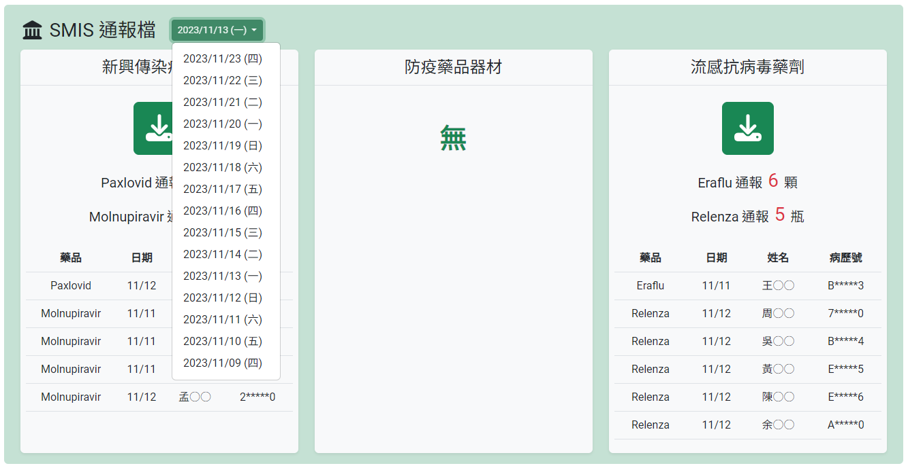

+++
title = '智慧防疫物資管理系統：介面'
slug = '2024-01-smis-ui'
date = 2024-01-04T13:07:58+08:00
draft = false
isCJKLanguage = true
showToc = true
TocOpen = true
categories = ['PHP','Javascript']
tags = ['PHP','Javascript','Bootstrap','CDN','filemtime','fileatime','filectime','mysql','array_column','foreach','$_POST','DatePeriod','DateInterval','array_reverse']
+++
上個月分別建立了關於智慧防疫物資管理系統的紀錄和通報功能細節，剩下的就是製作一個讓使用者可以跟資料互動的介面了！

這個介面為了讓各台電腦不用安裝執行檔，決定採用 web 的方式呈現，使用 php 做為後端資料庫溝通、後端 csv 檔案讀取，加上一點少少的 JavaScript 強化使用者體驗， CSS 和 JavaScript 以 CDN 方式引入，大概會做類似 SSR (Server-Side Rendering) 或類似 SPA (Singel Page Application) 的形式。
***
## 網頁切版
為了求快速，我使用 [Bootstrap](https://getbootstrap.com/) 裡面的網格 (grid) 功能進行網頁切版，規劃的概念圖如下：


依照文件說明，大概的寫出 html 代碼如下：
```html
<!doctype html>
<html>
  <head>
    <meta charset="utf-8">
    <meta name="viewport" content="width=device-width, initial-scale=1">
    <link href="https://cdn.jsdelivr.net/npm/bootstrap@5.3.2/dist/css/bootstrap.min.css" rel="stylesheet" integrity="" crossorigin="">
    <title>SMIS 通報介面</title>
  </head>
  <body>
    <div class="container">
      <div class="row"> <!--標題--->
        <div class="col">
        </div>
      </div>
      <div class="row"> <!--庫存和趨勢--->
        <div class="col">
        </div>
      </div>      
      <div class="row"> <!--待通報區域--->
        <div class="col">
        </div>
      </div>
      <div class="row"> <!--已通報區域--->
        <div class="col">
        </div>
      </div>
    </div>
  </body>
</html>
```

>之前為了快速建構網頁的面板，我使用 Bootstrap 都是以 cdn 的方式開始，不過這幾個月因為院方希望把我的東西轉到內網，呼叫 cdn 必然受到限制，因此我最近開始考慮學習比較現代化的前端開發 Orz 。

***
## 確認 csv 更新了沒
前面的文章有提到，利用 Python 匯出院內報表，整合出一個「三至四個月的所有資料」，命名為 `smis.csv` ，以便後續 php 的比對。

然而上線後，曾經發生因為院內程式更改 UI ， python 自動匯出的座標跟以前不一樣導致失去效果，程式無法整合出 `smis.csv` ，然而這個錯誤並沒有任何的提示， `smis.csv` 保持舊版沒有任何更新，使用者以為當日沒有需要通報的個案，兩三天過後才發現問題。

因此必須在頁面上顯示 `smis.csv` 更新時間，以防止院內程式的自動化失效。

檔案的時間標記分成三種：
- atime(**A**ccess time)：檔案上次被讀取的時間。
- ctime(status **C**hange time)：檔案的屬性或內容上次被修改的時間。
- mtime(**M**odified time)：檔案的內容上次被修改的時間。

以這邊的例子來說， python 程式自動形成檔案後，這三個時間都會一樣，但是 atime 可能會受到其他程式讀取而有所改變，因此要顯示更新時間最好使用 mtime 或 ctime ，可以利用 `filemtime` 方法把檔案的修改時間叫出來，但因為返回的時間值是 Unix 時間戳的格式，因此必須再用 `date` 將時間戳轉換成可閱讀的格式：
```php
<?php
$csvmtime = date("n/j H:m", filemtime("smis.csv"));
```

後來把這個更新時間放在主標題的旁邊以提醒使用者，如果發現更新時間停在昨天，就表示出現了 bug 導致檔案更新不全，需要找我釐清原因。

***
## 院內剩餘庫存
除了前面文章提到計算「待通報病人」以及將「已通報病人」的檔案下載後批次上傳 CDC 網頁之外，使用者也需要知道目前院內的庫存，是不是和 SMIS 網頁的數量相吻合，
因此需要顯示目前各個藥物的剩餘庫存數量。

為此必須額外建立的資料庫來紀錄藥品的庫存異動資料：
```mysql
CREATE TABLE `smis_stock` (
  `id` int(11) NOT NULL,
  `medicine` varchar(20) NOT NULL,      /*藥品名稱*/
  `quantity` mediumint(9) NOT NULL,     /*異動數量*/
  `action` varchar(10) NOT NULL,        /*異動原因*/
  `happendate` int(11) NOT NULL,        /*異動日期*/
  `insertdate` int(11) NOT NULL         /*資料新增日期*/
) ENGINE=InnoDB DEFAULT CHARSET=utf8;
```

庫存數量會利用「異動原因」來做分類計算，「異動原因」共分成三種情形：
- 結餘：宣告所有數量由此筆資料的日期**以後**進行計算。
- 入庫：政府撥補藥品給醫院。
- 退庫：政府回收藥品。

舉個例子，如果資料以 happendate 遞增排序：
```csv
id,medicine,quantity,action,happendate,insertdate
...
30,Paxlovid,20,入庫,20231001,...
31,Paxlovid,1520,結餘,20231003,...
32,Paxlovid,200,入庫,20231004,...
33,Paxlovid,-500,退庫,20231005,...
34,Paxlovid,40,入庫,20231010,...
35,Paxlovid,-60,退庫,20231025,...
```

由上方的資料列可以得知 Paxlovid 在 2023 年 10 月 03 日的結餘量是 1520 盒，「結餘」這個原因宣告數量由此筆資料以後進行計算，也就是說，第 30 筆資料不計，所有資料由第 31 筆開始，目前的庫存就是結餘量加上所有的進出量： `1520 + 200 + (-500) + 40 + (-60)` 。

```php
//目前庫存量
//找到各自的最後一個結餘日期
$fetchrows = $conn->query("SELECT `medicine`, `happendate` FROM `smis_stock` WHERE `action` = '結餘'")->fetchAll(PDO::FETCH_ASSOC);
$checkdate = array_column($fetchrows, "happendate", "medicine");
//庫存總和
foreach ($checkdate as $medicine => $happendate) {
    $fetchrows = $conn->query("SELECT SUM(`quantity`) FROM `smis_stock` WHERE `medicine` = '$medicine' AND `happendate` >= '$happendate'")->fetch(PDO::FETCH_NUM);
    $stock[$medicine] = $fetchrows[0];
}
```

計算出來的數字是所謂的`初始庫存`，而`已通報資料庫`中也可以加總計算「結餘日期」之後的使用數量，相減之後就是目前的剩餘庫存了。
```php
//扣除耗用
foreach ($checkdate as $medicine => $happendate) {
    $fetchrows = $conn->query("SELECT SUM(`quantity`) FROM `smis` WHERE `medicine` = '$medicine' AND `reportdate` >= '$happendate' AND `notreport` = '無' ")->fetch(PDO::FETCH_NUM);
    $inventory[$medicine] = $stock[$medicine] - $fetchrows[0];
}
```
***
## 待通報區域
前兩篇的結尾有提到，比對出來的資料 array 存在 php 的變數中之後，必須以網頁的介面展示，讓使用者瀏覽並決定是不是需要通報。

因此設計了一個區塊的內容並且搭配 `foreach` 將 array 迭代出來，展示如下：


這個區塊本身也是一個 html 表單，按下下方的按鈕後會將資料以 `POST` 的方式存入 `smis` 資料庫中當成已經通報的資料，只是因為每個 `<input>` 的 `name` 都必須是獨一無二的，因此可以利用 `name="xxx[]"` 的方式獨立出來：
```html
<?php if (count($yet)): ?>
  <div class="row pt-2">
      <div class="col">
          <form action="" method="post">
              <div class="bg-light rounded shadow-sm py-1 pb-3 text-center">
                  <table class="table mx-auto fs-6" style="width: 97%">
                      <thead>
                          <tr>
                              <th></th>
                              <th>藥品</th>
                              <th>姓名</th>
                              <th>病歷號</th>
                              <th>身分證字號</th>
                              <th>通報日期</th>
                              <th width="15%">通報數量</th>
                              <th>不報</th>
                              <th>備註</th>
                          </tr>
                      </thead>
                      <tbody>
                          <?php $i = 0 ; foreach ($yet as $row) : ?>
                              <input type="hidden" name="ptbirth[<?= $i; ?>]" value="<?= $row["ptbirth"]; ?>">
                              <input type="hidden" name="notes[<?= $i; ?>]" value="<?= $row["notes"]; ?>">
                              <tr>
                                  <td class="align-middle">
                                      <div class="form-check d-flex justify-content-center">
                                          <input class="form-check-input opacity-75" type="checkbox" name="do[<?= $i; ?>]" value="1" checked>
                                      </div>
                                  </td>
                                  <td class="text-center align-middle">
                                      <?= $row["medicine"]; ?><input type="hidden" name="medicine[<?= $i; ?>]" value="<?= $row["medicine"]; ?>">
                                  </td>
                                  <td class="text-center align-middle">
                                      <?= $row["ptname"]; ?><input type="hidden" name="ptname[<?= $i; ?>]" value="<?= $row["ptname"]; ?>">
                                  </td>                                        
                                  <td class="text-center align-middle">
                                      <?= $row["hosid"]; ?><input type="hidden" name="hosid[<?= $i; ?>]" value="<?= $row["hosid"]; ?>">
                                  </td>
                                  <td class="text-center align-middle">
                                      <?= $row["ptid"]; ?><input type="hidden" name="ptid[<?= $i; ?>]" value="<?= $row["ptid"]; ?>">
                                  </td>
                                  <td class="text-center align-middle">
                                      <?= date("n/j", strtotime($row["reportdate"])); ?><input type="hidden" name="reportdate[<?= $i; ?>]" value="<?= $row["reportdate"]; ?>">
                                  </td>
                                  <td class="align-middle">
                                      <input type="number" id="" name="quantity[<?= $i; ?>]" class="form-control text-center w-50 mx-auto" inputmode="numeric" required="" min="1" value="<?= $row["quantity"]; ?>">
                                  </td>
                                  <td class="align-middle">
                                      <div class="form-check d-flex justify-content-center">
                                          <input class="form-check-input" type="checkbox" name="notreport[<?= $i; ?>]" value="銷帳">
                                      </div>
                                  </td>
                                  <td class="text-center align-middle">
                                  </td>
                              </tr>
                          <?php $i++; endforeach; ?>
                      </tbody>
                  </table>
                  <button type="submit" class="btn btn-success btn-sm opacity-75" name="action" value="insertdb"><i class="fa-solid fa-paper-plane fa-fw me-1"></i>送出院內通報</button>
              </div>
          </form>
      </div>
  </div>
<?php endif;?>
```

如果在表單元素的 `name` 長成 `name="xxx[]"` 這個樣子， `POST` 給 php 之後， php 的 `$_POST["xxx"]` 也會變成 array ，也就是說如果表單長成下面這樣：
```html
<input type="text" name="xxx[0]" value="a">
<input type="text" name="xxx[1]" value="b">
<input type="text" name="xxx[2]" value="c">
<input type="text" name="xxx[3]" value="d">
<input type="text" name="xxx[4]" value="e">
```

使用 `POST` 給 php 之後， php 會接到以下的 array ：
```php
$_POST["xxx"] = array(
    0 => "a",
    1 => "b",
    2 => "c",
    3 => "d",
    4 => "e",
);
```

而不是：
```php
$_POST["xxx[0]"] = "a";
$_POST["xxx[1]"] = "b";
$_POST["xxx[2]"] = "c";
$_POST["xxx[3]"] = "d";
$_POST["xxx[4]"] = "e";
```

送出表單的部分，為了比較符合 SPA 的精神 (?) ，我習慣把表單 POST 給原本的頁面，並且在 php 加入 Mysql Insert 的語法，最後重新指向原本的頁面：
```php
if (isset($_POST["action"]) && ($_POST["action"]=="insertdb")) {
    $sql = "INSERT INTO `smis-b` (`id`, `medicine`, `ptid`, `ptname`, `hosid`, `ptbirth`, `reportdate`, `insertdate`, `quantity`, `notreport`, `notes`) VALUES ";
    for ($i=0; $i<count($_POST["medicine"]); $i++) {
        if (!isset($_POST["do"][$i])) continue;
        $medicine = $_POST["medicine"][$i];
        $ptid = $_POST["ptid"][$i];
        $ptname = $_POST["ptname"][$i];
        $hosid = $_POST["hosid"][$i];
        $ptbirth = $_POST["ptbirth"][$i];
        $reportdate = $_POST["reportdate"][$i];
        $insertdate = date("Ymd");
        $quantity = $_POST["quantity"][$i];
        $notreport = ($_POST["notreport"][$i]=="") ? "無" : $_POST["notreport"][$i];
        $notes = $_POST["notes"][$i];
        $sql .=  "(NULL, '$medicine', '$ptid', '$ptname', '$hosid', '$ptbirth', '$reportdate', '$insertdate', '$quantity', '$notreport', '$notes'),";
    }
    $sql = substr($sql, 0, -1) . ";";
    $stmt = $conn->prepare($sql);
    $stmt->execute();
    header("location:".$_SERVER["PHP_SELF"]);
}
```
***
## 已通報區域
已經通報的區域則是顯示出資料庫中的資料，上方的日期選單預設值為今天，選擇日期後，會顯示該日期通報過的資料：


>而且因為我不太會 JavaScript ，可以選擇的日期一樣使用 php 處理，實作之後發現並不會很慢，就這樣了。

php 的部分將已通報資料匯出成 `$already` 陣列變數：
```php
/* 可供選擇的日期 */
$period = new DatePeriod(new DateTime("-2 weeks"), new DateInterval("P1D"), new DateTime("+1 day"));
foreach ($period as $date) $daterange[] = $date->format("Y/m/d (").["日","一","二","三","四","五","六"][$date->format("w")].")";
$daterange = array_reverse($daterange);

/* 顯示資料 */
$smisdl = isset($_GET["smisdl"]) ? $_GET["smisdl"] : date("Ymd");
if ($smisdl!="") {
    $already = [];
    $alreadysum = [];
    $sql = "SELECT * FROM `smis` WHERE `insertdate` = '".$smisdl."'";
    $fetchrows = $conn->query($sql)->fetchAll(PDO::FETCH_ASSOC);
    foreach ($fetchrows as $key=>$row) {
        if ($key==0) $alreadysum[$row["medicine"]] = 0;
        $quantity = $row["quantity"];
        if ($row["notreport"]=="無") {            
            $alreadysum[$row["medicine"]] += $quantity;
        }
        $already[$row["medicine"]][] = [
            "dbid" => $row["id"],
            "ptid" => $row["ptid"],
            "ptname" => $row["ptname"],
            "hosid" => $row["hosid"],
            "reportdate" => date("n/j",strtotime($row["reportdate"])),
            "quantity" => $quantity,
            "notreport" => $row["notreport"],
        ];
    }
}
```

並且因為之前已經作出檔案下載的 API ，當指定藥品分類和日期時給指定網址時，就會自動下載 xlsx 檔案，所以直接設定超連結 href 即可：
```html
<?php if (isset($smisdl)&&($smisdl!="")) : ?>
    <div class="row pt-2">
        <div class="col-4 text-center">
            <div class="bg-light rounded shadow-sm pb-1 h-100">
                <div class="fs-4 text-center mb-2 py-2 border-bottom">新興傳染病用藥</div>
                <?php if ($alreadysum["Paxlovid"]+$alreadysum["Molnupiravir"]!=0): ?>
                    <a href="http://.../smisdl.php?category=新興傳染病用藥&insertdate=<?= $smisdl; ?>" class="btn btn-success my-3 py-2 fs-1 rounded-3"><i class="fa-solid fa-download fa-fw"></i></a>
                    <?php if (isset($already["Paxlovid"])): ?>
                        <div class="fs-5 text-center mb-2">
                            <div class="d-inline-flex">
                                <span class="my-auto pt-2">Paxlovid</span>
                                <span class="my-auto pt-2 ms-1">通報</span>
                                <span class="fs-3 text-danger my-auto mx-2"><?= $alreadysum["Paxlovid"]; ?></span>
                                <span class="my-auto pt-2">盒</span>
                            </div>
                        </div>
                    <?php endif; ?>
                    <?php if (isset($already["Molnupiravir"])): ?>
                        <div class="fs-5 text-center mb-2">
                            <div class="d-inline-flex">
                                <span class="my-auto pt-2">Molnupiravir</span>
                                <span class="my-auto pt-2 ms-1">通報</span>
                                <span class="fs-3 text-danger my-auto mx-2"><?= $alreadysum["Molnupiravir"]; ?></span>
                                <span class="my-auto pt-2">瓶</span>
                            </div>
                        </div>
                    <?php endif; ?>
                    <div class="mx-2 pt-3">
                        <table class="table">
                            <thead>
                                <tr>
                                    <th class="text-center align-middle">藥品</th>
                                    <th class="text-center align-middle">日期</th>
                                    <th class="text-center align-middle">姓名</th>
                                    <th class="text-center align-middle">病歷號</th>
                                </tr>
                            </thead>
                            <tbody>
                                <?php if (isset($already["Paxlovid"])): foreach ($already["Paxlovid"] as $row) : ?>
                                    <tr>
                                        <td class="text-center align-middle">Paxlovid</td>
                                        <td class="text-center align-middle"><?= $row["reportdate"]; ?></td>
                                        <td class="text-center align-middle"><?= $row["ptname"]; ?></td>
                                        <td class="text-center align-middle"><?= $row["hosid"]; ?></td>
                                    </tr>
                                <?php endforeach; endif; ?>
                                <?php if (isset($already["Molnupiravir"])): foreach ($already["Molnupiravir"] as $row) : ?>
                                    <tr>
                                        <td class="text-center align-middle">Molnupiravir</td>
                                        <td class="text-center align-middle"><?= $row["reportdate"]; ?></td>
                                        <td class="text-center align-middle"><?= $row["ptname"]; ?></td>
                                        <td class="text-center align-middle"><?= $row["hosid"]; ?></td>
                                    </tr>
                                <?php endforeach; endif; ?>
                            </tbody>
                        </table>
                    </div>
                <?php else: ?>
                    <div class="fs-1 text-success fw-bold my-5">無</div>
                <?php endif; ?>
            </div>
        </div>

        <div class="col-4 text-center">
            <div class="bg-light rounded shadow-sm pb-1 h-100">
                <div class="fs-4 text-center mb-2 py-2 border-bottom">防疫藥品器材</div>
                <?php if ($alreadysum["Remdesivir"]+$alreadysum["Evusheld"]!=0): ?>
                    <a href="http://.../smisdl.php?category=防疫藥品器材&insertdate=<?= $smisdl; ?>" class="btn btn-success my-3 py-2 fs-1 rounded-3"><i class="fa-solid fa-download fa-fw"></i></a>
                    <?php if (isset($already["Remdesivir"])): ?>
                        <div class="fs-5 text-center mb-2">
                            <div class="d-inline-flex">
                                <span class="my-auto pt-2">Remdesivir</span>
                                <span class="my-auto pt-2 ms-1">通報</span>
                                <span class="fs-3 text-danger my-auto mx-2"><?= $alreadysum["Remdesivir"]; ?></span>
                                <span class="my-auto pt-2">支</span>
                            </div>
                        </div>
                    <?php endif; ?>
                    <?php if (isset($already["Evusheld"])): ?>
                        <div class="fs-5 text-center mb-2">
                            <div class="d-inline-flex">
                                <span class="my-auto pt-2">Evusheld</span>
                                <span class="my-auto pt-2 ms-1">通報</span>
                                <span class="fs-3 text-danger my-auto mx-2"><?= $alreadysum["Evusheld"]; ?></span>
                                <span class="my-auto pt-2">盒</span>
                            </div>
                        </div>
                    <?php endif; ?>
                    <div class="mx-2 pt-3">
                        <table class="table">
                            <thead>
                                <tr>
                                    <th class="text-center align-middle">藥品</th>
                                    <th class="text-center align-middle">日期</th>
                                    <th class="text-center align-middle">姓名</th>
                                    <th class="text-center align-middle">病歷號</th>
                                </tr>
                            </thead>
                            <tbody>
                                <?php if (isset($already["Remdesivir"])): foreach ($already["Remdesivir"] as $row) : ?>
                                    <tr>
                                        <td class="text-center align-middle">Remdesivir</td>
                                        <td class="text-center align-middle"><?= $row["reportdate"]; ?></td>
                                        <td class="text-center align-middle"><?= $row["ptname"]; ?></td>
                                        <td class="text-center align-middle"><?= $row["hosid"]; ?></td>
                                    </tr>
                                <?php endforeach; endif; ?>
                                <?php if (isset($already["Evusheld"])): foreach ($already["Evusheld"] as $row) : ?>
                                    <tr>
                                        <td class="text-center align-middle">Evusheld</td>
                                        <td class="text-center align-middle"><?= $row["reportdate"]; ?></td>
                                        <td class="text-center align-middle"><?= $row["ptname"]; ?></td>
                                        <td class="text-center align-middle"><?= $row["hosid"]; ?></td>
                                    </tr>
                                <?php endforeach; endif; ?>
                            </tbody>
                        </table>
                    </div>
                <?php else: ?>
                    <div class="fs-1 text-success fw-bold my-5">無</div>
                <?php endif; ?>
            </div>
        </div>

        <div class="col-4 text-center">
            <div class="bg-light rounded shadow-sm pb-1 h-100">
                <div class="fs-4 text-center mb-2 py-2 border-bottom">流感抗病毒藥劑</div>
                <?php if ($alreadysum["Tamiflu"]+$alreadysum["Eraflu"]+$alreadysum["Relenza"]!=0): ?>
                    <a href="http://.../smisdl.php?category=流感抗病毒藥劑&insertdate=<?= $smisdl; ?>" class="btn btn-success my-3 py-2 fs-1 rounded-3"><i class="fa-solid fa-download fa-fw"></i></a>
                    <?php if (isset($already["Tamiflu"])): ?>
                        <div class="fs-5 text-center mb-2">
                            <div class="d-inline-flex">
                                <span class="my-auto pt-2">Tamiflu</span>
                                <span class="my-auto pt-2 ms-1">通報</span>
                                <span class="fs-3 text-danger my-auto mx-2"><?= $alreadysum["Tamiflu"]; ?></span>
                                <span class="my-auto pt-2">顆</span>
                            </div>
                        </div>
                    <?php endif; ?>
                    <?php if (isset($already["Eraflu"])): ?>
                        <div class="fs-5 text-center mb-2">
                            <div class="d-inline-flex">
                                <span class="my-auto pt-2">Eraflu</span>
                                <span class="my-auto pt-2 ms-1">通報</span>
                                <span class="fs-3 text-danger my-auto mx-2"><?= $alreadysum["Eraflu"]; ?></span>
                                <span class="my-auto pt-2">顆</span>
                            </div>
                        </div>
                    <?php endif; ?>                                
                    <?php if (isset($already["Relenza"])): ?>
                        <div class="fs-5 text-center mb-2">
                            <div class="d-inline-flex">
                                <span class="my-auto pt-2">Relenza</span>
                                <span class="my-auto pt-2 ms-1">通報</span>
                                <span class="fs-3 text-danger my-auto mx-2"><?= $alreadysum["Relenza"]; ?></span>
                                <span class="my-auto pt-2">瓶</span>
                            </div>
                        </div>
                    <?php endif; ?>
                    <?php if (isset($already["Oseltamivir"])): ?>
                        <div class="fs-5 text-center mb-2">
                            <div class="d-inline-flex">
                                <span class="my-auto pt-2">Oseltamivir</span>
                                <span class="my-auto pt-2 ms-1">通報</span>
                                <span class="fs-3 text-danger my-auto mx-2"><?= $alreadysum["Oseltamivir"]; ?></span>
                                <span class="my-auto pt-2">瓶</span>
                            </div>
                        </div>
                    <?php endif; ?>
                    <div class="mx-2 pt-3">
                        <table class="table">
                            <thead>
                                <tr>
                                    <th class="text-center align-middle">藥品</th>
                                    <th class="text-center align-middle">日期</th>
                                    <th class="text-center align-middle">姓名</th>
                                    <th class="text-center align-middle">病歷號</th>
                                </tr>
                            </thead>
                            <tbody>
                                <?php if (isset($already["Tamiflu"])): foreach ($already["Tamiflu"] as $row) : ?>
                                    <tr>
                                        <td class="text-center align-middle">Tamiflu</td>
                                        <td class="text-center align-middle"><?= $row["reportdate"]; ?></td>
                                        <td class="text-center align-middle"><?= $row["ptname"]; ?></td>
                                        <td class="text-center align-middle"><?= $row["hosid"]; ?></td>
                                    </tr>
                                <?php endforeach; endif; ?>
                                <?php if (isset($already["Eraflu"])): foreach ($already["Eraflu"] as $row) : ?>
                                    <tr>
                                        <td class="text-center align-middle">Eraflu</td>
                                        <td class="text-center align-middle"><?= $row["reportdate"]; ?></td>
                                        <td class="text-center align-middle"><?= $row["ptname"]; ?></td>
                                        <td class="text-center align-middle"><?= $row["hosid"]; ?></td>
                                    </tr>
                                <?php endforeach; endif; ?>
                                <?php if (isset($already["Relenza"])): foreach ($already["Relenza"] as $row) : ?>
                                    <tr>
                                        <td class="text-center align-middle">Relenza</td>
                                        <td class="text-center align-middle"><?= $row["reportdate"]; ?></td>
                                        <td class="text-center align-middle"><?= $row["ptname"]; ?></td>
                                        <td class="text-center align-middle"><?= $row["hosid"]; ?></td>
                                    </tr>
                                <?php endforeach; endif; ?>
                                <?php if (isset($already["Oseltamivir"])): foreach ($already["Oseltamivir"] as $row) : ?>
                                    <tr>
                                        <td class="text-center align-middle">Oseltamivir</td>
                                        <td class="text-center align-middle"><?= $row["reportdate"]; ?></td>
                                        <td class="text-center align-middle"><?= $row["ptname"]; ?></td>
                                        <td class="text-center align-middle"><?= $row["hosid"]; ?></td>
                                    </tr>
                                <?php endforeach; endif; ?>
                            </tbody>
                        </table>
                    </div>
                <?php else: ?>
                    <div class="fs-1 text-success fw-bold my-5">無</div>
                <?php endif; ?>
            </div>
        </div>
    </div>
<?php endif; ?>
```
>我好喜歡義大利麵式寫法喔嘿嘿嘿嘿。🤪🤪🤪
***
## ~~使用趨勢圖表~~
~~疫情比較嚴重的 2019 年到 2022 年間，為了視覺化使用情形，以方便觀察趨勢，如同前面提過的方式也使用了 chartjs 將以通報資料庫的數值製作成簡單的圖表。 2023 年開始，隨著指揮中心解散，疫情緩和之後，視覺化的需求就下降了，為了節省網頁的資源，後來就直接刪除了。~~
