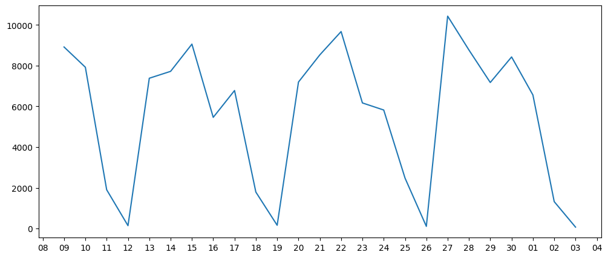

+++
title = '藥品採購需求預測：簡單數學模型'
slug = 'Medicine-purchasing-forecast-with-simple-math-model'
date = 2024-02-07T09:58:36+08:00
draft = true
isCJKLanguage = true
showToc = true
TocOpen = true
categories = []
tags = []
+++
上一篇有說明醫院產生藥品採購單的方法，總結一下我們需要的參數有：
- 目前庫存量
- 已經採購的在途量
- 安全量
- 採購基準量
有了這些參數之後，我們就可以產生**現在**的藥品採購單。

那有沒有辦法產生**未來的**藥品採購單呢？
***
## 未來的採購需求
現在的採購需求是來自於下面的邏輯：

如果目前庫存量 + 在途量 < 安全量，則計算 [( 基準量 - 庫存量 ) // 基準量 ] × 基準量
>**//** 表示相除後得到商數和餘數，只取商數，例如 10//3=3 ，但有些時候我會相除之後讓商數呈現小數點，再將商數四捨五入取整數。

也就是說，如果我們需要未來的採購需求，應該是把邏輯變成：

如果**未來**庫存量 + 在途量 < 安全量，則計算 [( 基準量 - 庫存量 ) // 基準量 ] × 基準量

而未來的庫存量其實就是目前的庫存量 - 未來的消耗量，假設今天是 2 月 7 日，如果我想知道 3 月 7 日的庫存量，就是把目前的庫存量 - 各個藥品 28 天的消耗量就可以了。

所以下一個問題是，未來消耗量怎麼計算？
***
## 時間序列預測
藥品的消耗資料先前已經被整理成每日統計的形式，可以被視為一組時間序列 (Time Series) ，以本院的 Plavix 75mg Tablet 為例，將日期當作 x 軸，消耗量當成 y 軸，就可以簡單畫出下面的折線圖。


時間序列預測未來的數值是這幾年來的顯學之一，歷經了使用機器學習法的 ARIMA ，到如今深度學習大爆發時代的 LSTM 、 GRU 等等大家都致力發展這一塊，其中一個最夯的時間序列大概就是股票了吧，雖然股票的變因太多導致 AI 學習的成果通常都有限。

深度學習的部份，因為受限於醫院硬體，速度與效能的部分都需要多方的調整，這個日後找機會再談。這邊先簡單以傳統數學模型介紹現行使用的未來消耗量的預測。

### 傳統數學模型
傳統數學用來預測未來的數值的方法其實就是平均值和標準差 (Standard Deviation) ，以下面的資料為例：
```csv
date,consumption
20231106,9594
20231107,7266
20231108,8924
20231109,8917
20231110,7923
20231111,1906
20231112,143
20231113,7383
20231114,7721
20231115,9058
20231116,5462
20231117,6779
20231118,1792
20231119,162
20231120,7196
20231121,8528
20231122,9675
20231123,6170
20231124,5822
20231125,2478
20231126,109
20231127,10432
20231128,8767
20231129,7174
20231130,8428
20231201,6561
20231202,1323
20231203,71
```

可以求得平均值為 5920 ， 標準差為 3346 ，因此我們可以判斷 2023 年 12 月 4 日的消耗量可能為 5920 ± 3346 = 9266 ~ 2574 之間。

這樣的數字其實沒什麼意義，因為忽略了一些大前提，我們以平均值和標準差來預測未來的數值時，母體數值群 ( 也就是被用來計算的過去資料 ) 必須呈現常態分佈，並且資料必須平穩集中。

### 資料的降採樣


***
## 程式流程規劃與實作
***
## 成果